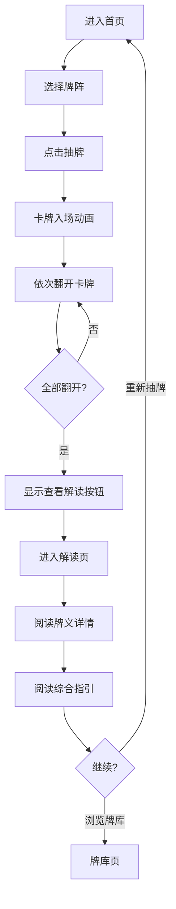

# BlackRice Tarot - 项目上下文

> 更新日期：2026-03-12

## 项目概述

**BlackRice Tarot**（黑米塔罗）是一款基于 Vite + Vue3 + TypeScript 的轻量级塔罗占卜 Web App，支持 GitHub Pages 部署及 Capacitor 打包原生 App。产品名字源自小黑猫"黑米"，融合塔罗的神秘感与黑猫的灵性。

### 核心特点

| 特点 | 描述 |
|------|------|
| 🚀 即开即用 | 无需注册，打开即可使用 |
| 🌙 视觉沉浸 | 神秘感强的深色金色主题 |
| 👆 轻交互 | 简洁的点击/翻牌交互体验 |
| 📱 跨端适配 | PC、移动端、原生 App |
| 🔮 专业内容 | 基于韦特塔罗的专业解读 |
| 🌍 国际化 | 中英双语支持 |

---

## 技术栈

### 核心技术

| 技术 | 版本 | 用途 |
|------|------|------|
| Vue | 3.4+ | UI 框架（组合式 API） |
| TypeScript | 5.x | 类型安全 |
| Vite | 5.x | 构建工具 |
| Tailwind CSS | 3.x | 原子化 CSS |
| Vue Router | 4.x | 路由管理 |
| vue-i18n | 11.x | 国际化 |
| Capacitor | 8.x | 原生 App 打包 |

### 辅助库

| 库 | 用途 |
|----|------|
| motion-v | 动画库（Vue 版 Framer Motion） |
| lucide-vue-next | 图标库 |
| clsx + tailwind-merge | 条件类名合并 |
| @vueuse/core | Vue 组合式工具库 |
| @capacitor/haptics | 震动反馈 |
| @capacitor/share | 系统分享 |
| @capacitor/preferences | 本地存储 |

---

## 项目结构

```
tarot/
├── .cursor/                    # Cursor IDE 配置
│   └── context.md              # 项目上下文（本文件）
├── .github/
│   └── workflows/
│       └── deploy.yml          # GitHub Actions 自动部署
├── docs/                       # 产品与技术文档
│   ├── product/                # PRD、UX 设计、用户流程
│   ├── technical/              # 技术架构、API 设计、路线图
│   └── reference/              # 塔罗牌参考资料
├── public/
│   └── favicon.svg             # 网站图标
├── src/
│   ├── assets/
│   │   └── tarot/              # 塔罗牌图片资源
│   │       ├── 178/            # 莱德韦特牌组图片
│   │       └── README.md       # 牌组资源说明
│   ├── components/             # 组件
│   │   ├── tarot/              # 塔罗业务组件
│   │   │   └── TarotCard.vue   # 塔罗牌卡片
│   │   ├── ui/                 # 基础 UI 组件
│   │   │   └── button.vue
│   │   ├── NavBar.vue          # 导航栏
│   │   ├── StarBackground.vue  # 星空背景
│   │   ├── TipsBox.vue         # 提示框
│   │   └── AppFooter.vue       # 页脚
│   ├── composables/            # 组合式函数
│   │   ├── useTarot.ts         # 塔罗状态管理
│   │   ├── useDevice.ts        # 设备检测
│   │   └── useNative.ts        # 原生能力封装
│   ├── data/                   # 数据层
│   │   ├── index.ts            # 数据导出、多语言数据加载
│   │   ├── tarot-base.json     # 基础配置（逆位概率等）
│   │   └── card-images.ts      # 卡牌图片路径工具
│   ├── directives/             # Vue 指令
│   │   └── vHoloFoil.ts        # 全息闪卡效果
│   ├── i18n/                   # 国际化
│   │   ├── index.ts            # i18n 配置
│   │   └── locales/
│   │       ├── zh.json         # 中文 UI 文案
│   │       ├── en.json         # 英文 UI 文案
│   │       └── cards/
│   │           ├── zh.json     # 中文牌义（78张）
│   │           └── en.json     # 英文牌义（78张）
│   ├── layouts/                # 布局组件
│   │   └── MainLayout.vue      # 主布局
│   ├── lib/                    # 工具库
│   │   └── utils.ts            # 通用工具函数 (cn)
│   ├── pages/                  # 页面视图
│   │   ├── Home.vue            # 首页（抽牌）
│   │   ├── Reading.vue         # 解读页
│   │   ├── Library.vue         # 牌库页
│   │   └── Settings.vue        # 设置页
│   ├── router/                 # 路由配置
│   │   └── index.ts
│   ├── styles/                 # 样式
│   │   └── globals.css         # 全局样式
│   ├── App.vue                 # 根组件
│   ├── main.ts                 # 入口文件
│   └── vite-env.d.ts           # Vite 类型声明
├── capacitor.config.ts         # Capacitor 配置
├── index.html                  # HTML 入口
├── package.json                # 依赖配置（pnpm）
├── pnpm-lock.yaml              # 依赖锁定
├── postcss.config.js           # PostCSS 配置
├── tailwind.config.js          # Tailwind 配置
├── tsconfig.json               # TypeScript 配置
├── tsconfig.node.json          # Node TypeScript 配置
└── vite.config.ts              # Vite 配置
```

---

## 国际化架构

### 语言文件结构

```
src/i18n/
├── index.ts              # i18n 配置（自动检测浏览器语言）
└── locales/
    ├── zh.json           # 中文 UI 文案
    ├── en.json           # 英文 UI 文案
    └── cards/
        ├── zh.json       # 中文牌义数据
        └── en.json       # 英文牌义数据
```

### 多语言数据加载

```typescript
// 使用方式 1：在组件中使用 UI 文案
const { t } = useI18n()
const label = t('home.drawButton') // "开始抽牌" / "Draw Cards"

// 使用方式 2：获取响应式牌义数据
const { majorArcana, suits, tips, spreads } = useTarot()
// 数据会随 locale 变化自动切换语言
```

### 支持的语言

| 语言代码 | 语言名称 | 状态 |
|---------|---------|------|
| `zh` | 简体中文 | ✅ 完整 |
| `en` | English | ✅ 完整 |

---

## Capacitor 集成

### 配置文件

```typescript
// capacitor.config.ts
{
  appId: 'com.blackrice.tarot',
  appName: 'BlackRice Tarot',
  webDir: 'dist',
}
```

### 可用插件

| 插件 | 用途 | composable |
|------|------|------------|
| @capacitor/haptics | 震动反馈 | `useNative().hapticFeedback()` |
| @capacitor/share | 系统分享 | `useNative().shareCard()` |
| @capacitor/preferences | 本地存储 | `useNative().saveData()` / `loadData()` |
| @capacitor/status-bar | 状态栏控制 | - |
| @capacitor/splash-screen | 启动屏 | - |

### 构建命令

```bash
# Web 构建（GitHub Pages）
pnpm build

# Capacitor 构建（原生 App）
pnpm build:cap

# 打开 iOS 项目（需先 npx cap add ios）
pnpm app:ios

# 打开 Android 项目（需先 npx cap add android）
pnpm app:android
```

---

## SOP：开发与部署流程

### 1. 本地开发

```bash
# 安装依赖
pnpm install

# 启动开发服务器
pnpm dev

# 访问 http://localhost:5173
```

### 2. 构建测试

```bash
# 构建生产版本
pnpm build

# 本地预览构建结果
pnpm preview
```

### 3. 部署到 GitHub Pages

#### 方式 A：自动部署（推荐）

1. 将代码推送到 GitHub 仓库的 `main` 分支
2. 进入仓库 Settings → Pages
3. Source 选择 "GitHub Actions"
4. 推送代码后自动触发部署

#### 方式 B：手动部署

```bash
pnpm deploy
```

### 4. Capacitor App 构建

```bash
# 首次添加平台
npx cap add ios      # 需要 Mac + Xcode
npx cap add android  # 需要 Android Studio

# 构建并打开原生项目
pnpm app:ios
pnpm app:android
```

---

## 核心功能

### 当前实现 (MVP v1.0 + i18n)

- [x] 78 张塔罗牌完整数据（22大 + 56小阿尔卡纳）
- [x] 三种牌阵：单牌、三牌阵、五牌阵
- [x] 正位/逆位随机（30% 逆位概率）
- [x] 点击翻牌交互 + 3D 翻转动画
- [x] 全息闪卡效果（6种风格）
- [x] 完整解读面板（牌义、关键词、象征、综合指引）
- [x] 星空背景动画
- [x] 占卜小贴士轮播
- [x] 金色神秘主题
- [x] 响应式布局（移动端底部导航/PC端顶部导航）
- [x] 牌库浏览页面
- [x] 多牌组支持（Emoji + 韦特塔罗）
- [x] **i18n 国际化（中英双语）**
- [x] **Capacitor 项目结构（原生 App 支持）**
- [x] GitHub Pages 一键部署

### 扩展方向

- [ ] 更多牌阵（凯尔特十字等）
- [ ] 抽牌历史记录（LocalStorage）
- [ ] 每日一牌功能
- [ ] 分享功能（生成卡片）
- [ ] AI 解读集成
- [ ] PWA 离线支持
- [ ] iOS/Android App 上架

---

## 设计系统

### 颜色变量

```css
/* 核心金色 */
--gold: #ffd700           /* 主金色 - 用于强调、标题 */
--gold-dark: #c9a227      /* 深金色 - 用于悬停、渐变 */
--gold-light: #ffb347     /* 浅金色 - 用于渐变终点 */

/* 背景色 */
--background: #1a1a2e     /* 主背景 - 深紫蓝 */
--muted: rgba(255, 255, 255, 0.05)  /* 抬升背景 */

/* 文本色 */
--foreground: #e8d5b7     /* 主文本 - 暖白 */
--muted-foreground: #a8a8b3 /* 次文本 - 灰色 */

/* 语义色 */
--success: #4ade80        /* 正位标签 */
--warning: #f87171        /* 逆位标签 */
```

### 交互流程



---

## 配置项

### 逆位概率

在 `src/data/tarot-base.json` 中：

```json
{
  "config": {
    "reversedProbability": 0.3
  }
}
```

### 牌阵配置

牌阵数据位于语言文件 `src/i18n/locales/cards/{lang}.json` 的 `spreads` 字段：

```json
{
  "spreads": {
    "1": {
      "name": "单牌占卜",
      "description": "最简单的牌阵，适合每日指引或快速问答",
      "positions": [{ "name": "今日指引", "row": 0, "col": 0 }]
    }
  }
}
```

### 语言设置

语言偏好存储在 `localStorage` 的 `tarot-locale` 键中，默认自动检测浏览器语言。

---

## 内容呈现原则

1. **反思工具定位** - 塔罗作为自我探索的镜子，而非命运预测
2. **正向引导** - 即使是"困难"牌也提供建设性解读
3. **明确 AI 定位** - 娱乐和自我反思用途，不提供决策建议
4. **尊重传统** - 基于韦特塔罗经典含义，不随意臆造

---

## 常见问题

### Q: 部署后页面空白？

检查 `vite.config.ts` 中的 `base` 是否与仓库名匹配。

### Q: 如何添加新语言？

1. 在 `src/i18n/locales/` 下创建 `{lang}.json`（UI 文案）
2. 在 `src/i18n/locales/cards/` 下创建 `{lang}.json`（牌义数据）
3. 在 `src/data/index.ts` 的 `cardDataMap` 中注册新语言
4. 在 `src/i18n/index.ts` 的 `messages` 中添加新语言
5. 在 Settings 页面的 `languageOptions` 中添加选项

### Q: 如何修改牌阵？

1. 在所有语言的 `cards/{lang}.json` 的 `spreads` 中添加新牌阵
2. 在 `src/data/index.ts` 的 `generateSummary` 中添加对应解读逻辑

### Q: 如何构建原生 App？

1. 运行 `pnpm build:cap` 构建 Web 资源
2. 运行 `npx cap add ios` 或 `npx cap add android`
3. 运行 `npx cap sync` 同步资源
4. 运行 `npx cap open ios` 或 `npx cap open android` 打开原生项目

---

## 相关资源

- [Vue 3 文档](https://vuejs.org/)
- [Vite 文档](https://vitejs.dev/)
- [Tailwind CSS 文档](https://tailwindcss.com/)
- [vue-i18n 文档](https://vue-i18n.intlify.dev/)
- [Capacitor 文档](https://capacitorjs.com/docs)
- [GitHub Pages 文档](https://docs.github.com/en/pages)
- 项目文档：`docs/` 目录
