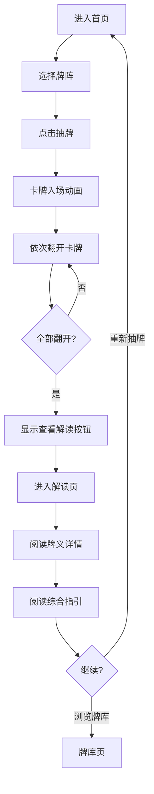

# BlackRice Tarot - 项目上下文

> 更新日期：2026-03-11

## 项目概述

**BlackRice Tarot**（黑米塔罗）是一款基于 Vite + Vue3 + TypeScript 的轻量级塔罗占卜 Web App，支持一键部署到 GitHub Pages。产品名字源自小黑猫"黑米"，融合塔罗的神秘感与黑猫的灵性。

### 核心特点

| 特点 | 描述 |
|------|------|
| 🚀 即开即用 | 无需注册，打开即可使用 |
| 🌙 视觉沉浸 | 神秘感强的深色金色主题 |
| 👆 轻交互 | 简洁的点击/翻牌交互体验 |
| 📱 跨端适配 | 完美支持 PC 和移动端 |
| 🔮 专业内容 | 基于韦特塔罗的专业解读 |

---

## 技术栈

### 核心技术

| 技术 | 版本 | 用途 |
|------|------|------|
| Vue | 3.4+ | UI 框架（组合式 API） |
| TypeScript | 5.x | 类型安全 |
| Vite | 5.x | 构建工具 |
| Tailwind CSS | 3.x | 原子化 CSS |
| Vue Router | 4.x | 路由管理 |

### 辅助库

| 库 | 用途 |
|----|------|
| motion-v | 动画库（Vue 版 Framer Motion） |
| lucide-vue-next | 图标库 |
| clsx + tailwind-merge | 条件类名合并 |

---

## 项目结构

```
tarot/
├── .cursor/                    # Cursor IDE 配置
│   └── context.md              # 项目上下文（本文件）
├── .github/
│   └── workflows/
│       └── deploy.yml          # GitHub Actions 自动部署
├── docs/                       # 产品与技术文档
│   ├── product/                # PRD、UX 设计、用户流程
│   ├── technical/              # 技术架构、API 设计、路线图
│   └── reference/              # 塔罗牌参考资料
├── public/
│   └── favicon.svg             # 网站图标
├── src/
│   ├── components/             # 组件
│   │   ├── tarot/              # 塔罗业务组件
│   │   │   └── TarotCard.vue   # 塔罗牌卡片
│   │   ├── ui/                 # 基础 UI 组件
│   │   │   └── button.vue
│   │   ├── NavBar.vue          # 导航栏
│   │   ├── StarBackground.vue  # 星空背景
│   │   ├── TipsBox.vue         # 提示框
│   │   └── AppFooter.vue       # 页脚
│   ├── composables/            # 组合式函数
│   │   └── useTarot.ts         # 塔罗状态管理
│   ├── data/                   # 数据层
│   │   ├── index.ts            # 数据导出和工具函数
│   │   └── tarot.json          # 塔罗牌数据（JSON 分离）
│   ├── layouts/                # 布局组件
│   │   └── MainLayout.vue      # 主布局
│   ├── lib/                    # 工具库
│   │   └── utils.ts            # 通用工具函数 (cn)
│   ├── pages/                  # 页面视图
│   │   ├── Home.vue            # 首页（抽牌）
│   │   ├── Reading.vue         # 解读页
│   │   ├── Library.vue         # 牌库页
│   │   └── Settings.vue        # 设置页
│   ├── router/                 # 路由配置
│   │   └── index.ts
│   ├── styles/                 # 样式
│   │   └── globals.css         # 全局样式
│   ├── App.vue                 # 根组件
│   ├── main.ts                 # 入口文件
│   └── vite-env.d.ts           # Vite 类型声明
├── index.html                  # HTML 入口
├── package.json                # 依赖配置（pnpm）
├── pnpm-lock.yaml              # 依赖锁定
├── postcss.config.js           # PostCSS 配置
├── tailwind.config.js          # Tailwind 配置
├── tsconfig.json               # TypeScript 配置
├── tsconfig.node.json          # Node TypeScript 配置
└── vite.config.ts              # Vite 配置
```

---

## SOP：开发与部署流程

### 1. 本地开发

```bash
# 安装依赖
pnpm install

# 启动开发服务器
pnpm dev

# 访问 http://localhost:5173
```

### 2. 构建测试

```bash
# 构建生产版本
pnpm build

# 本地预览构建结果
pnpm preview
```

### 3. 部署到 GitHub Pages

#### 方式 A：自动部署（推荐）

1. 将代码推送到 GitHub 仓库的 `main` 分支
2. 进入仓库 Settings → Pages
3. Source 选择 "GitHub Actions"
4. 推送代码后自动触发部署

#### 方式 B：手动部署

```bash
pnpm deploy
```

### 4. 配置仓库名

如果仓库名不是 `tarot`，需要修改 `vite.config.ts`:

```typescript
export default defineConfig({
  plugins: [vue()],
  base: '/你的仓库名/',
})
```

---

## 核心功能

### 当前实现 (MVP v1.0)

- [x] 22 张大阿卡纳牌完整数据（含描述、注解、星座对应）
- [x] 三种牌阵：单牌、三牌阵、五牌阵
- [x] 正位/逆位随机（30% 逆位概率，可配置）
- [x] 点击翻牌交互 + 3D 翻转动画
- [x] 完整解读面板（牌义、关键词、象征、综合指引）
- [x] 星空背景动画
- [x] 占卜小贴士轮播
- [x] 金色神秘主题
- [x] 响应式布局（移动端底部导航/PC端顶部导航）
- [x] 牌库浏览页面
- [x] GitHub Pages 一键部署

### 扩展方向

- [ ] 56 张小阿卡纳牌（权杖/圣杯/宝剑/金币）
- [ ] 更多牌阵（凯尔特十字等）
- [ ] 牌面图片资源
- [ ] 抽牌历史记录（LocalStorage）
- [ ] 每日一牌功能
- [ ] 分享功能（生成卡片）
- [ ] AI 解读集成
- [ ] PWA 离线支持

---

## 设计系统

### 颜色变量

```css
/* 核心金色 */
--gold: #ffd700           /* 主金色 - 用于强调、标题 */
--gold-dark: #c9a227      /* 深金色 - 用于悬停、渐变 */
--gold-light: #ffb347     /* 浅金色 - 用于渐变终点 */

/* 背景色 */
--background: #1a1a2e     /* 主背景 - 深紫蓝 */
--muted: rgba(255, 255, 255, 0.05)  /* 抬升背景 */

/* 文本色 */
--foreground: #e8d5b7     /* 主文本 - 暖白 */
--muted-foreground: #a8a8b3 /* 次文本 - 灰色 */

/* 语义色 */
--success: #4ade80        /* 正位标签 */
--warning: #f87171        /* 逆位标签 */
```

### 交互流程



---

## 配置项

### 逆位概率

在 `src/data/tarot.json` 中：

```json
{
  "config": {
    "reversedProbability": 0.3
  }
}
```

### 牌阵配置

```json
{
  "spreads": {
    "1": ["今日指引"],
    "3": ["过去", "现在", "未来"],
    "5": ["现状", "挑战", "过去", "未来", "建议"]
  }
}
```

---

## 内容呈现原则

1. **反思工具定位** - 塔罗作为自我探索的镜子，而非命运预测
2. **正向引导** - 即使是"困难"牌也提供建设性解读
3. **明确 AI 定位** - 娱乐和自我反思用途，不提供决策建议
4. **尊重传统** - 基于韦特塔罗经典含义，不随意臆造

---

## 常见问题

### Q: 部署后页面空白？

检查 `vite.config.ts` 中的 `base` 是否与仓库名匹配。

### Q: 如何添加新牌？

编辑 `src/data/tarot.json`，在 `majorArcana` 数组中添加新牌数据。

### Q: 如何修改牌阵？

1. 在 `spreads` 中添加新牌阵
2. 在 `src/pages/Home.vue` 的 `spreads` 数组中添加选项
3. 在 `src/data/index.ts` 的 `generateSummary` 中添加对应解读逻辑

---

## 相关资源

- [Vue 3 文档](https://vuejs.org/)
- [Vite 文档](https://vitejs.dev/)
- [Tailwind CSS 文档](https://tailwindcss.com/)
- [GitHub Pages 文档](https://docs.github.com/en/pages)
- 项目文档：`docs/` 目录
