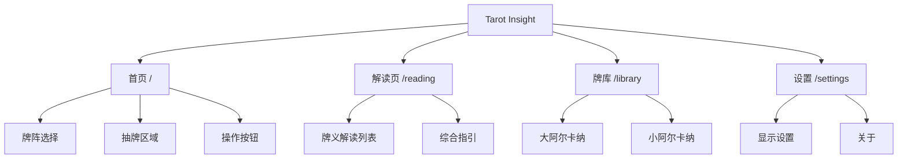
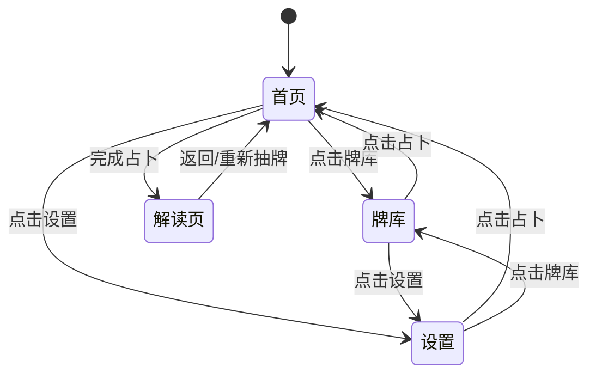
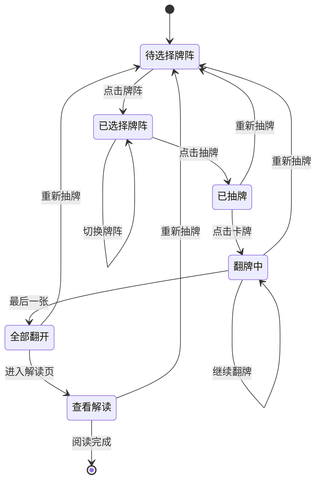

# Tarot Insight - 信息架构 (IA)

> 版本：1.0  
> 更新日期：2026-03-11  
> 作者：UX 团队

---

## 一、站点地图

### 1.1 页面层级结构



### 1.2 页面清单

| 页面 | 路由 | 功能 | 优先级 |
|------|------|------|--------|
| 首页 | `/` | 牌阵选择与抽牌 | P0 |
| 解读页 | `/reading` | 查看占卜结果 | P0 |
| 牌库 | `/library` | 浏览所有塔罗牌 | P1 |
| 设置 | `/settings` | 应用设置 | P2 |
| 每日塔罗 | `/daily` | 每日一卡 | V2 |
| 历史记录 | `/history` | 占卜记录 | V2 |

---

## 二、导航结构

### 2.1 全局导航

```
┌────────────────────────────────────────────────┐
│                                                │
│    [🏠 占卜]    [📚 牌库]    [⚙️ 设置]         │
│                                                │
└────────────────────────────────────────────────┘
```

| 导航项 | 图标 | 目标页面 | 说明 |
|--------|------|----------|------|
| 占卜 | Home | `/` | 核心功能入口 |
| 牌库 | BookOpen | `/library` | 知识浏览 |
| 设置 | Settings | `/settings` | 个性化配置 |

### 2.2 上下文导航

| 页面 | 导航元素 | 说明 |
|------|----------|------|
| 解读页 | 返回按钮 | 返回首页 |
| 解读页 | 重新抽牌 | 重置并返回首页 |

### 2.3 导航状态



---

## 三、页面信息架构

### 3.1 首页 (HomeView)

```
┌─────────────────────────────────────────────────┐
│                    Header                       │
│  ┌───────────────────────────────────────────┐  │
│  │ ✦ 塔罗牌占卜 ✦                            │  │
│  │ 聆听宇宙的低语                            │  │
│  │ 2026年3月11日 星期三                       │  │
│  └───────────────────────────────────────────┘  │
├─────────────────────────────────────────────────┤
│                Tips Box (PC)                    │
│  ┌───────────────────────────────────────────┐  │
│  │ 💡 塔罗小贴士 (轮播)                       │  │
│  └───────────────────────────────────────────┘  │
├─────────────────────────────────────────────────┤
│              Spread Selector                    │
│  ┌─────────┐ ┌─────────┐ ┌─────────┐           │
│  │  单牌   │ │ 三牌阵  │ │ 五牌阵  │           │
│  └─────────┘ └─────────┘ └─────────┘           │
├─────────────────────────────────────────────────┤
│                Cards Area                       │
│                                                 │
│     ┌─────┐   ┌─────┐   ┌─────┐                │
│     │     │   │     │   │     │                │
│     │ 🎴  │   │ 🎴  │   │ 🎴  │                │
│     │     │   │     │   │     │                │
│     └─────┘   └─────┘   └─────┘                │
│      过去       现在       未来                  │
│                                                 │
├─────────────────────────────────────────────────┤
│               Action Area                       │
│                                                 │
│            ┌────────────────┐                   │
│            │   开始抽牌      │                   │
│            └────────────────┘                   │
│   ┌──────────────┐  ┌──────────────┐           │
│   │   重新抽牌    │  │  查看解读 →  │           │
│   └──────────────┘  └──────────────┘           │
│                                                 │
├─────────────────────────────────────────────────┤
│                Footer (PC)                      │
│  ┌───────────────────────────────────────────┐  │
│  │ 🔮 仅供娱乐和自我反思                      │  │
│  └───────────────────────────────────────────┘  │
└─────────────────────────────────────────────────┘
```

#### 信息层级

| 层级 | 内容 | 重要性 |
|------|------|--------|
| L1 | 页面标题 + 日期 | 建立氛围 |
| L2 | 牌阵选择器 | 核心决策点 |
| L3 | 卡牌展示区 | 主要内容 |
| L4 | 操作按钮 | 关键行动 |
| L5 | 提示/页脚 | 辅助信息 |

### 3.2 解读页 (ReadingView)

```
┌─────────────────────────────────────────────────┐
│                 Header Bar                      │
│  ┌────┐                          ┌──────────┐  │
│  │ ←  │   ✦ 牌阵解读 ✦           │ 重新抽牌 │  │
│  └────┘                          └──────────┘  │
├─────────────────────────────────────────────────┤
│              Scrollable Content                 │
│  ┌───────────────────────────────────────────┐  │
│  │ Card 1: 愚者                              │  │
│  │ ┌─────────────────────────────────────┐   │  │
│  │ │ 🃏  愚者  (过去)           [正位]   │   │  │
│  │ ├─────────────────────────────────────┤   │  │
│  │ │ 牌义解读                             │   │  │
│  │ │ 新的开始、无限可能、勇敢追梦...      │   │  │
│  │ │                                     │   │  │
│  │ │ [自由] [冒险] [天真]                │   │  │
│  │ │                                     │   │  │
│  │ │ 象征意义                             │   │  │
│  │ │ 代表旅程的起点...                    │   │  │
│  │ │                                     │   │  │
│  │ │ 卡面描述                             │   │  │
│  │ │ 悬崖边的年轻人...                    │   │  │
│  │ └─────────────────────────────────────┘   │  │
│  └───────────────────────────────────────────┘  │
│                                                 │
│  ┌───────────────────────────────────────────┐  │
│  │ Card 2: 魔术师                            │  │
│  │ ... (同上结构)                            │  │
│  └───────────────────────────────────────────┘  │
│                                                 │
│  ┌───────────────────────────────────────────┐  │
│  │ Card 3: 女祭司                            │  │
│  │ ... (同上结构)                            │  │
│  └───────────────────────────────────────────┘  │
│                                                 │
│  ┌───────────────────────────────────────────┐  │
│  │ ✦ 综合指引 ✦                              │  │
│  │ ┌─────────────────────────────────────┐   │  │
│  │ │ 从过去到未来的能量流动来看...        │   │  │
│  │ └─────────────────────────────────────┘   │  │
│  └───────────────────────────────────────────┘  │
│                                                 │
└─────────────────────────────────────────────────┘
```

#### 卡片信息结构

```yaml
Card:
  - header:
      - symbol: 表情符号
      - name: 牌名
      - position: 位置含义
      - status: 正位/逆位
  - body:
      - interpretation: 牌义解读
      - keywords: 关键词标签
      - symbolism: 象征意义
      - description: 卡面描述
```

### 3.3 牌库 (LibraryView)

```
┌─────────────────────────────────────────────────┐
│                    Header                       │
│  ┌───────────────────────────────────────────┐  │
│  │ ✦ 牌库 ✦                                  │  │
│  │ 探索塔罗的奥秘                            │  │
│  └───────────────────────────────────────────┘  │
├─────────────────────────────────────────────────┤
│              Scrollable Content                 │
│  ┌───────────────────────────────────────────┐  │
│  │ 大阿尔卡纳 (Major Arcana)                 │  │
│  │ 22张代表人生重大主题的牌                  │  │
│  ├───────────────────────────────────────────┤  │
│  │ ┌─────┐ ┌─────┐ ┌─────┐ ┌─────┐          │  │
│  │ │ 🃏  │ │ 🎩  │ │ 🌙  │ │ 👑  │ ...      │  │
│  │ │  0  │ │  I  │ │ II  │ │ III │          │  │
│  │ │愚者 │ │魔术师│ │女祭司│ │女皇 │          │  │
│  │ └─────┘ └─────┘ └─────┘ └─────┘          │  │
│  │                                           │  │
│  │ ... (共22张)                              │  │
│  └───────────────────────────────────────────┘  │
│                                                 │
│  ┌───────────────────────────────────────────┐  │
│  │ 小阿尔卡纳 (Minor Arcana)                 │  │
│  │ 56张反映日常生活细节的牌                  │  │
│  ├───────────────────────────────────────────┤  │
│  │                                           │  │
│  │          [ 即将推出 ]                     │  │
│  │                                           │  │
│  └───────────────────────────────────────────┘  │
│                                                 │
└─────────────────────────────────────────────────┘
```

#### 牌库数据结构

```yaml
Library:
  - Major Arcana:
      count: 22
      cards:
        - id, number, name, nameEn, symbol
      status: active
  - Minor Arcana:
      count: 56
      suits:
        - Wands (权杖)
        - Cups (圣杯)
        - Swords (宝剑)
        - Pentacles (金币)
      status: coming_soon
```

### 3.4 设置页 (SettingsView)

```
┌─────────────────────────────────────────────────┐
│                    Header                       │
│  ┌───────────────────────────────────────────┐  │
│  │ ✦ 设置 ✦                                  │  │
│  │ 个性化你的占卜体验                        │  │
│  └───────────────────────────────────────────┘  │
├─────────────────────────────────────────────────┤
│              Settings Groups                    │
│  ┌───────────────────────────────────────────┐  │
│  │ 显示设置                                   │  │
│  ├───────────────────────────────────────────┤  │
│  │ 深色模式              ──────○ ON          │  │
│  │ 减少动效              ○────── OFF         │  │
│  └───────────────────────────────────────────┘  │
│                                                 │
│  ┌───────────────────────────────────────────┐  │
│  │ 占卜设置                                   │  │
│  ├───────────────────────────────────────────┤  │
│  │ 逆位概率              [====|====] 30%     │  │
│  └───────────────────────────────────────────┘  │
│                                                 │
│  ┌───────────────────────────────────────────┐  │
│  │ 关于                                       │  │
│  ├───────────────────────────────────────────┤  │
│  │ 版本                  v1.0.0               │  │
│  │ 反馈                  >                    │  │
│  │ 隐私政策              >                    │  │
│  └───────────────────────────────────────────┘  │
│                                                 │
└─────────────────────────────────────────────────┘
```

---

## 四、数据模型

### 4.1 核心数据结构

```typescript
// 塔罗牌
interface TarotCard {
  id: string           // 'major-0', 'minor-wands-1'
  number: string       // '0', 'I', '1'
  name: string         // '愚者'
  nameEn: string       // 'The Fool'
  keywords: string     // '自由、冒险、天真'
  symbol: string       // '🃏'
  upright: string      // 正位含义
  reversed: string     // 逆位含义
  description?: string // 卡面描述
  note?: string        // 象征意义
}

// 抽到的牌
interface DrawnCard extends TarotCard {
  isReversed: boolean  // 是否逆位
  position: string     // 位置含义 ('过去', '现在', '未来')
}

// 牌阵类型
type SpreadType = 1 | 3 | 5 | 10

// 牌阵配置
interface SpreadConfig {
  type: SpreadType
  name: string         // '三牌阵'
  positions: string[]  // ['过去', '现在', '未来']
}

// 占卜记录 (V2)
interface ReadingRecord {
  id: string
  timestamp: number
  spreadType: SpreadType
  cards: DrawnCard[]
  summary: string
  question?: string    // 用户问题 (V2)
}
```

### 4.2 状态管理

```typescript
// 全局状态 (Composable: useTarot)
interface TarotState {
  currentSpread: SpreadType      // 当前选择的牌阵
  drawnCards: DrawnCard[]        // 抽到的牌
  flippedCount: number           // 已翻开数量
  isDrawn: boolean               // 是否已抽牌
  allFlipped: boolean            // 是否全部翻开
  summary: string                // 综合解读
  positions: string[]            // 当前牌阵的位置
}

// Actions
interface TarotActions {
  selectSpread(type: SpreadType): void
  drawCards(): void
  flipCard(): void
  resetReading(): void
}
```

### 4.3 本地存储 (V2)

```typescript
// LocalStorage Keys
const STORAGE_KEYS = {
  SETTINGS: 'tarot_settings',
  HISTORY: 'tarot_history',
  DAILY_CARD: 'tarot_daily'
}

// 设置数据
interface Settings {
  darkMode: boolean
  reducedMotion: boolean
  reversedProbability: number
}

// 每日卡数据
interface DailyCard {
  date: string         // 'YYYY-MM-DD'
  card: DrawnCard
  viewed: boolean
}
```

---

## 五、内容策略

### 5.1 牌义内容结构

每张塔罗牌包含以下内容层次：

| 内容层 | 字段 | 长度 | 用途 |
|--------|------|------|------|
| 标识 | name, nameEn, number | - | 基础识别 |
| 快速理解 | keywords | 3个关键词 | 快速扫描 |
| 牌义详解 | upright, reversed | 4个短语 | 深度理解 |
| 象征说明 | description | 1-2句 | 视觉联想 |
| 背景知识 | note | 1句 | 专业补充 |

### 5.2 综合解读生成逻辑

```typescript
// 单牌
`今日的指引是「${card.name}」${逆位标识}。${能量解读}。`

// 三牌阵
`从过去到未来的能量流动来看：
 过去的「${cards[0].name}」影响了你的现状，
 目前「${cards[1].name}」是你面对的核心课题，
 而「${cards[2].name}」指向了未来的发展方向。`

// 五牌阵
`五牌阵揭示了完整的能量图景：
 你目前的状态是「${cards[0].name}」，
 面临的挑战是「${cards[1].name}」。
 过去的「${cards[2].name}」为现在奠定了基础，
 未来将朝「${cards[3].name}」的方向发展。
 综合来看，「${cards[4].name}」是给你的核心建议。`
```

### 5.3 提示内容库

```yaml
tips:
  - category: 基础知识
    content: "塔罗牌共有78张，其中大阿尔卡纳22张代表人生重大主题..."
  - category: 解读技巧
    content: "逆位并不一定代表'坏'，它可能意味着能量减弱..."
  - category: 使用建议
    content: "抽牌前，请先静心冥想，将注意力集中在你想询问的问题上..."
  - category: 文化背景
    content: "本系统基于最经典的韦特塔罗（Rider-Waite Tarot）..."
```

---

## 六、URL 与路由设计

### 6.1 路由表

| 路由 | 组件 | 元信息 | 说明 |
|------|------|--------|------|
| `/` | HomeView | `{ title: '占卜' }` | 首页 |
| `/reading` | ReadingView | `{ title: '解读', requiresReading: true }` | 解读页 |
| `/library` | LibraryView | `{ title: '牌库' }` | 牌库 |
| `/settings` | SettingsView | `{ title: '设置' }` | 设置 |

### 6.2 路由守卫

```typescript
// 解读页守卫：必须有占卜数据才能访问
router.beforeEach((to, from) => {
  if (to.meta.requiresReading && !hasReadingData()) {
    return { path: '/' }
  }
})
```

### 6.3 V2 路由扩展

| 路由 | 说明 |
|------|------|
| `/daily` | 每日塔罗 |
| `/history` | 历史记录 |
| `/card/:id` | 单牌详情 |
| `/spread/:type` | 牌阵介绍 |

---

## 七、用户流状态机

### 7.1 占卜流程状态机



### 7.2 状态描述

| 状态 | 可见元素 | 可用操作 |
|------|----------|----------|
| 待选择牌阵 | 牌阵按钮、提示文字 | 选择牌阵 |
| 已选择牌阵 | 高亮牌阵、抽牌按钮 | 切换牌阵、抽牌 |
| 已抽牌 | 卡牌（背面）、重抽按钮 | 翻牌、重抽 |
| 翻牌中 | 部分翻开的卡牌 | 继续翻牌、重抽 |
| 全部翻开 | 所有牌面、查看解读按钮 | 查看解读、重抽 |
| 查看解读 | 解读内容 | 返回、重抽 |

---

## 八、搜索与过滤 (V2)

### 8.1 牌库搜索

```yaml
搜索范围:
  - 牌名 (中/英文)
  - 关键词
  - 牌义内容

过滤维度:
  - 按类型: 大阿尔卡纳 / 小阿尔卡纳
  - 按花色: 权杖 / 圣杯 / 宝剑 / 金币
  - 按编号: 0-21 / 1-14

排序选项:
  - 默认 (编号顺序)
  - 字母顺序
```

### 8.2 历史记录筛选

```yaml
筛选维度:
  - 按日期范围
  - 按牌阵类型
  - 按特定牌出现

排序选项:
  - 最新优先
  - 最早优先
```

---

## 九、性能优化策略

### 9.1 代码分割

```typescript
// 路由级别懒加载
const routes = [
  { path: '/', component: () => import('./views/HomeView.vue') },
  { path: '/reading', component: () => import('./views/ReadingView.vue') },
  { path: '/library', component: () => import('./views/LibraryView.vue') },
  { path: '/settings', component: () => import('./views/SettingsView.vue') }
]
```

### 9.2 资源优化

| 资源 | 策略 |
|------|------|
| 字体 | Google Fonts + font-display: swap |
| 图标 | Tree-shakable Lucide Icons |
| 图片 | 懒加载 + WebP 格式 (V2) |
| 动画 | CSS 动画 + GPU 加速 |

### 9.3 缓存策略

```yaml
浏览器缓存:
  - HTML: no-cache
  - JS/CSS: 1年 (hash 命名)
  - 字体: 1年

LocalStorage:
  - 设置: 永久
  - 历史: 最多100条
  - 每日卡: 当日有效
```

---

## 十、国际化预留 (V3)

### 10.1 多语言架构

```yaml
支持语言:
  - zh-CN (简体中文) - 默认
  - zh-TW (繁体中文)
  - en (English)
  - ja (日本语)

翻译范围:
  - UI 界面文本
  - 牌名
  - 牌义解读
  - 提示内容
```

### 10.2 日期/数字格式

```typescript
// 使用 Intl API
const dateFormatter = new Intl.DateTimeFormat(locale, options)
const numberFormatter = new Intl.NumberFormat(locale, options)
```
