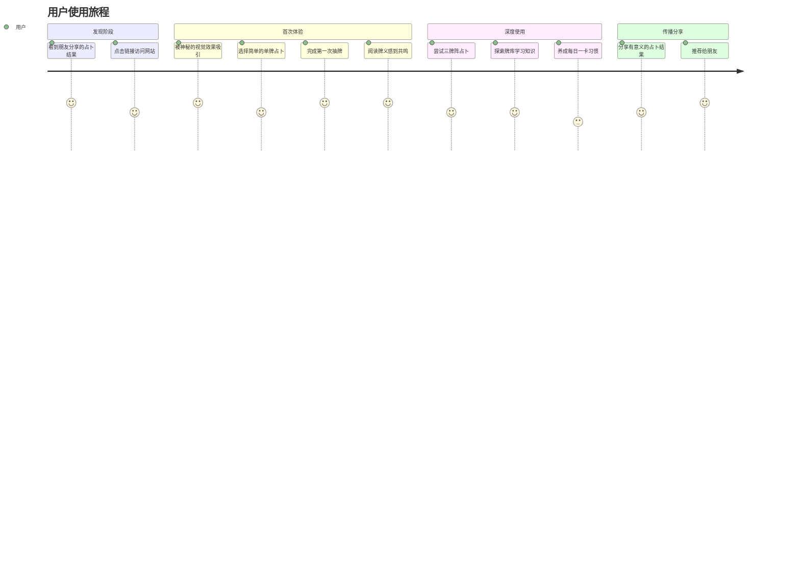
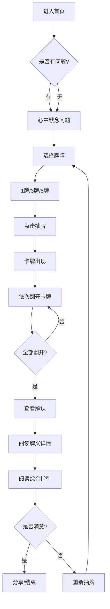
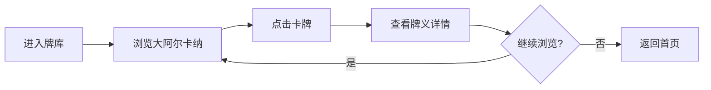
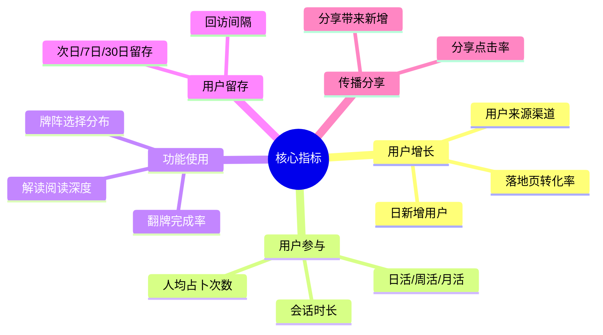

# BlackRice Tarot - 产品需求文档 (PRD)

> 版本：1.0  
> 更新日期：2026-03-11  
> 作者：产品团队

---

## 一、产品概述

### 1.1 产品名称

**BlackRice Tarot** （黑米塔罗）

### 1.2 产品定位

一款**轻量级塔罗占卜 Web App**，用户可以通过抽取塔罗牌获得对问题的启发性解读。

### 1.3 核心特点

| 特点 | 描述 |
|------|------|
| 🚀 即开即用 | 无需注册，打开即可使用 |
| 🌙 视觉沉浸 | 神秘感强的深色金色主题 |
| 👆 轻交互 | 简洁的点击/翻牌交互体验 |
| 📱 跨端适配 | 完美支持 PC 和移动端 |
| 🔮 专业内容 | 基于韦特塔罗的专业解读 |

### 1.4 产品愿景

打造一款**让每个人都能轻松体验塔罗占卜魅力**的数字产品，将传统神秘学与现代交互体验相结合。

### 1.5 产品目标

1. **快速占卜** - 3 步内完成一次完整占卜
2. **沉浸体验** - 创造仪式感和神秘氛围
3. **可分享结果** - 支持占卜结果的社交分享

---

## 二、目标用户

### 2.1 用户画像

#### 画像 A：情绪探索型用户

```yaml
年龄: 18-35 岁
性别: 女性为主 (70%)
职业: 学生、白领、自由职业者
需求场景:
  - 感情困惑时寻求指引
  - 工作决策前的心理暗示
  - 人生方向迷茫时的自我探索
使用行为:
  - 夜间使用为主 (20:00-24:00)
  - 移动端为主要入口
  - 单次使用时长 3-5 分钟
心理特征:
  - 对神秘事物感兴趣
  - 寻求情感寄托
  - 倾向于自我反思
```

#### 画像 B：神秘学兴趣用户

```yaml
年龄: 22-40 岁
性别: 不限
职业: 多元化
需求场景:
  - 了解不同牌阵的含义
  - 学习塔罗牌知识
  - 日常占卜实践
使用行为:
  - 固定时间使用 (如每日一卡)
  - PC 和移动端均有使用
  - 会深入阅读牌义解释
心理特征:
  - 对塔罗有一定了解
  - 追求占卜的专业性
  - 愿意探索不同牌阵
```

### 2.2 用户旅程地图



---

## 三、功能规划

### 3.1 MVP 功能列表 (v1.0)

| 功能模块 | 功能点 | 优先级 | 状态 |
|----------|--------|--------|------|
| **占卜核心** | 单牌占卜 | P0 | ✅ 已实现 |
| | 三牌阵占卜 | P0 | ✅ 已实现 |
| | 五牌阵占卜 | P0 | ✅ 已实现 |
| | 正/逆位随机 | P0 | ✅ 已实现 |
| **牌义系统** | 22张大阿尔卡纳 | P0 | ✅ 已实现 |
| | 每张牌详细解读 | P0 | ✅ 已实现 |
| | 综合指引生成 | P0 | ✅ 已实现 |
| **视觉体验** | 星空背景动画 | P1 | ✅ 已实现 |
| | 翻牌动画 | P1 | ✅ 已实现 |
| | 卡片展开动画 | P1 | ✅ 已实现 |
| **信息浏览** | 牌库浏览 | P1 | ✅ 已实现 |
| | 占卜小贴士 | P2 | ✅ 已实现 |

### 3.2 V2 功能规划

| 功能模块 | 功能点 | 优先级 | 价值说明 |
|----------|--------|--------|----------|
| **每日塔罗** | 每日一卡推送 | P1 | 提高用户留存和日活 |
| | 每日运势解读 | P1 | 增加内容丰富度 |
| **高级牌阵** | 凯尔特十字 (10牌) | P1 | 满足进阶用户需求 |
| | 关系牌阵 | P2 | 细分场景覆盖 |
| | 自定义牌阵 | P3 | 高级用户个性化 |
| **AI 解读** | AI 生成个性化解读 | P1 | 核心差异化功能 |
| | 多牌组合分析 | P2 | 深度解读能力 |
| **社交分享** | 生成分享卡片 | P1 | 病毒式传播 |
| | 分享到社交平台 | P1 | 用户增长引擎 |
| **内容扩展** | 56张小阿尔卡纳 | P2 | 完整塔罗体验 |
| | 牌面图片资源 | P2 | 视觉升级 |
| **用户功能** | 抽牌历史记录 | P2 | 用户数据沉淀 |
| | PWA 离线支持 | P3 | 极致体验优化 |

### 3.3 功能优先级矩阵

```
      高价值
         │
    P1   │   P0
  每日卡 │  核心占卜
  AI解读 │  牌义系统
  分享   │  
─────────┼───────────
    P3   │   P2
  PWA    │  小阿尔卡纳
  自定义 │  历史记录
         │  牌面图片
      低价值
   低实现难度 ← → 高实现难度
```

---

## 四、核心用户流程

### 4.1 主流程：完整占卜



### 4.2 辅助流程：牌库浏览



### 4.3 关键路径分析

| 步骤 | 操作 | 预期时长 | 关键指标 |
|------|------|----------|----------|
| 1 | 进入首页 | 2s | 页面加载时间 |
| 2 | 选择牌阵 | 3s | 点击选择率 |
| 3 | 点击抽牌 | 1s | 按钮点击率 |
| 4 | 翻开卡牌 | 5-15s | 完成翻牌率 |
| 5 | 查看解读 | 30-60s | 解读阅读完成率 |

**总体目标**：用户从进入到完成一次占卜 < 90 秒

---

## 五、业务规则

### 5.1 牌阵规则

| 牌阵 | 牌数 | 位置含义 | 适用场景 |
|------|------|----------|----------|
| 单牌 | 1 | 今日指引 | 每日快速占卜 |
| 三牌阵 | 3 | 过去→现在→未来 | 事件发展趋势 |
| 五牌阵 | 5 | 现状、挑战、过去、未来、建议 | 深度分析 |

### 5.2 正逆位规则

- **逆位概率**：30%（可配置）
- **逆位含义**：能量减弱、需要关注的盲点、内在表现
- **设计原则**：逆位不代表"坏"，而是另一种视角

### 5.3 内容呈现原则

1. **反思工具定位** - 塔罗作为自我探索的镜子，而非命运预测
2. **正向引导** - 即使是"困难"牌也提供建设性解读
3. **明确 AI 定位** - 娱乐和自我反思用途，不提供决策建议
4. **尊重传统** - 基于韦特塔罗经典含义，不随意臆造

---

## 六、非功能需求

### 6.1 性能要求

| 指标 | 目标值 | 说明 |
|------|--------|------|
| 首屏加载 | < 2s | FCP (First Contentful Paint) |
| 交互响应 | < 100ms | 点击到视觉反馈 |
| 动画帧率 | 60fps | 翻牌、展开动画 |
| 包体积 | < 500KB | Gzip 后 |

### 6.2 兼容性要求

| 平台 | 要求 |
|------|------|
| 浏览器 | Chrome 80+, Safari 13+, Firefox 78+, Edge 80+ |
| 移动端 | iOS 13+, Android 8+ |
| 分辨率 | 320px - 2560px 宽度响应式 |

### 6.3 可访问性要求

- 支持键盘导航
- 色彩对比度 AAA 级
- 动画可关闭（减少动效模式）

---

## 七、数据指标

### 7.1 北极星指标

**周活跃占卜次数 (WAD - Weekly Active Divinations)**

### 7.2 核心指标体系



### 7.3 数据埋点清单

| 事件名称 | 触发时机 | 关键参数 |
|----------|----------|----------|
| page_view | 页面加载完成 | page_name, referrer |
| spread_select | 选择牌阵 | spread_type |
| draw_start | 点击抽牌 | spread_type |
| card_flip | 翻开卡牌 | card_index, card_name |
| reading_view | 进入解读页 | spread_type, cards |
| reading_complete | 阅读完成（滚动到底） | read_duration |
| reset_click | 重新抽牌 | from_page |
| share_click | 点击分享 | share_platform |

---

## 八、里程碑计划

### Phase 1: MVP (当前)

- [x] 核心占卜功能
- [x] 基础视觉体验
- [x] 响应式布局
- [x] 牌库浏览

### Phase 2: 体验优化

- [ ] 占卜引导优化
- [ ] 问题输入功能
- [ ] 洗牌动画增强
- [ ] 牌面图片资源

### Phase 3: 功能扩展

- [ ] 每日塔罗
- [ ] 更多牌阵（凯尔特十字）
- [ ] 56张小阿尔卡纳
- [ ] 分享功能

### Phase 4: 智能化

- [ ] AI 解读集成
- [ ] 个性化推荐
- [ ] 历史记录

---

## 九、风险与依赖

### 9.1 风险识别

| 风险 | 影响 | 概率 | 缓解措施 |
|------|------|------|----------|
| 内容合规 | 高 | 中 | 明确娱乐定位，添加免责声明 |
| 性能瓶颈 | 中 | 低 | 图片懒加载，动画优化 |
| 竞品模仿 | 低 | 高 | 持续迭代，建立品牌 |

### 9.2 外部依赖

| 依赖项 | 用途 | 备选方案 |
|--------|------|----------|
| GitHub Pages | 静态托管 | Vercel, Netlify |
| Google Fonts | 字体服务 | 本地字体 |
| OpenAI API | AI 解读 (V2) | 本地规则引擎 |

---

## 十、附录

### 10.1 术语表

| 术语 | 解释 |
|------|------|
| 大阿尔卡纳 | Major Arcana，22张代表人生重大主题的牌 |
| 小阿尔卡纳 | Minor Arcana，56张反映日常生活的牌 |
| 牌阵 | Spread，牌的排列方式和解读框架 |
| 正位 | Upright，牌面朝上的正常位置 |
| 逆位 | Reversed，牌面倒置的位置 |
| 韦特塔罗 | Rider-Waite Tarot，最流行的塔罗牌系统 |

### 10.2 参考资料

- 韦特塔罗标准释义
- 现代塔罗占卜实践
- Web App 最佳实践指南
