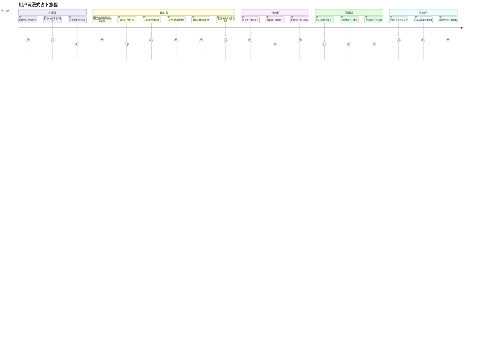
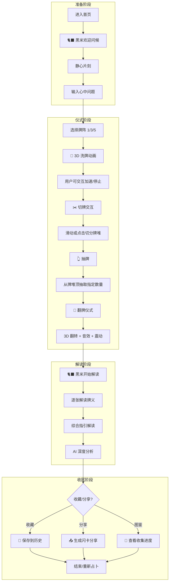
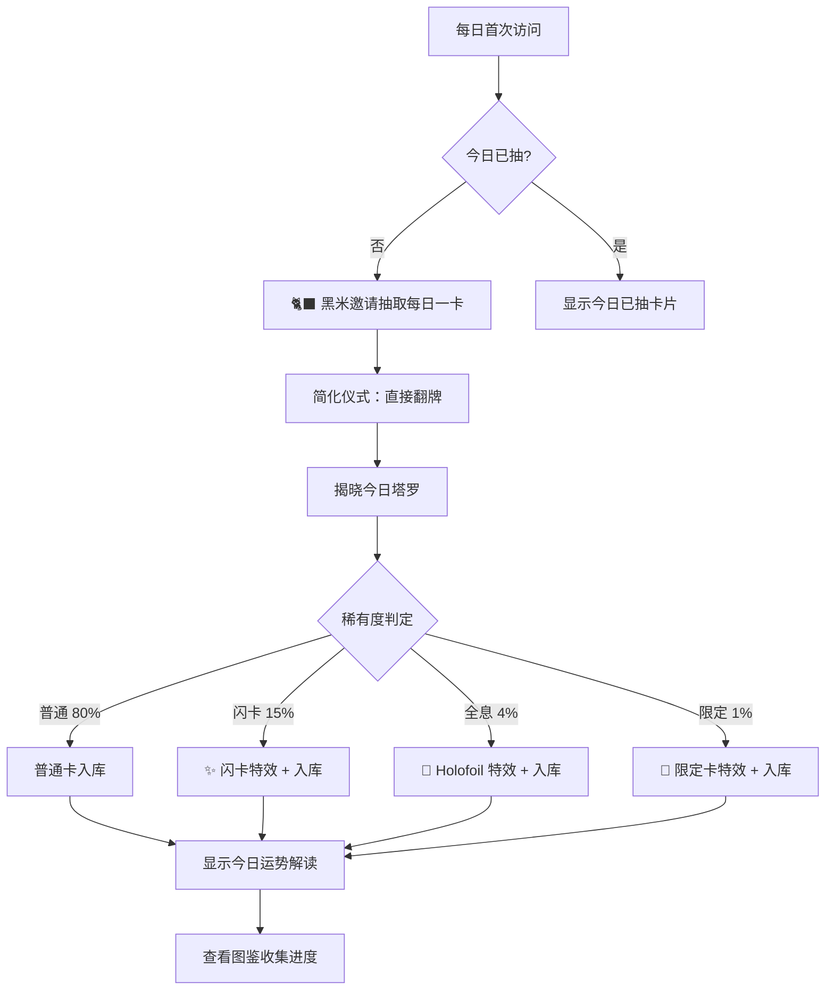
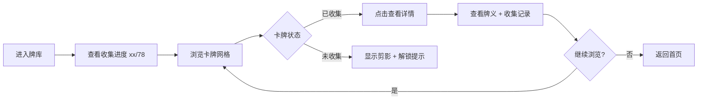
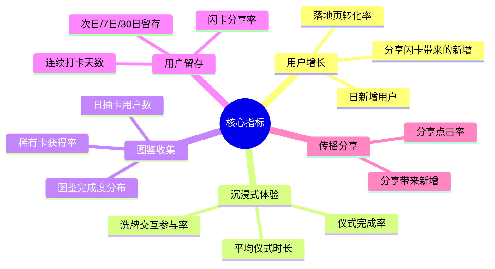

# BlackRice Tarot - 产品需求文档 (PRD)

> 版本：1.1  
> 更新日期：2026-03-11  
> 作者：产品团队

---

## 一、产品概述

### 1.1 产品名称

**BlackRice Tarot** （黑米塔罗）

### 1.2 产品定位

一款**沉浸式塔罗占卜 Web App**，通过仪式感的交互体验，让用户在神秘的氛围中获得内心的指引与启发。

> 🐈‍⬛ 由神秘的黑猫「黑米」为你解读命运的低语。

### 1.3 核心特点

| 特点 | 描述 |
|------|------|
| 🌙 沉浸仪式 | 完整的洗牌→切牌→抽牌→翻牌仪式流程 |
| ✨ 交互体验 | 3D 动效驱动的沉浸式交互（Three.js） |
| 🌅 每日一卡 | 每日单牌占卜 + 今日运势指引，轻量入口培养习惯 |
| 🎴 图鉴收集 | 每日占卜开卡，收集闪卡图鉴（普通/闪/全息/限定） |
| 🐈‍⬛ IP 陪伴 | 黑米（占卜者）& 面包（问卜者）角色系统 |
| 📱 跨端适配 | 完美支持 PC 和移动端 |
| 🔮 专业内容 | 基于韦特塔罗 78 张完整牌组 |

### 1.4 产品愿景

打造一款**让每个人都能沉浸体验塔罗占卜魅力**的数字产品：

- 将传统神秘学与现代 3D 交互体验相结合
- 以「每日一卡」为轻量入口，培养用户每日打卡习惯
- 通过图鉴收集系统建立长期用户粘性
- 以 IP 角色陪伴用户的占卜旅程

### 1.5 产品目标

| 目标 | 描述 | 指标 |
|------|------|------|
| **仪式感体验** | 完整的占卜仪式流程，而非简单点击 | 用户会话时长 > 3 分钟 |
| **沉浸式交互** | 3D 洗牌、切牌、翻牌的真实感 | 交互完成率 > 80% |
| **每日打卡** | 每日一卡培养用户习惯 | DAU 稳定增长 |
| **收集成就感** | 图鉴收集激励每日回访 | 7日留存 > 30% |
| **社交传播** | 分享闪卡、占卜结果 | 分享率 > 5% |

### 1.6 产品 Slogan

> "聆听宇宙的低语" / "Listen to the whispers of the universe"

---

## 二、目标用户

### 2.1 用户画像

#### 核心用户画像：「面包」型用户 🐱

> 像白猫面包一样，对世界充满好奇，愿意探索未知，寻求内心指引的人。

```yaml
人格特征:
  - 好奇心强，愿意尝试新事物
  - 对神秘学、灵性话题感兴趣
  - 享受仪式感和沉浸式体验
  - 有收集癖，喜欢解锁成就

核心需求:
  - 在迷茫时寻求一个"指引"或"暗示"
  - 享受占卜过程本身的仪式感
  - 通过收集图鉴获得成就感
  - 分享有趣的结果给朋友
```

#### 画像 A：情绪探索型（问卜者 Querent）

```yaml
年龄: 18-35 岁
性别: 女性为主 (70%)
职业: 学生、白领、自由职业者
需求场景:
  - 感情困惑时寻求指引
  - 工作决策前的心理暗示
  - 人生方向迷茫时的自我探索
使用行为:
  - 夜间使用为主 (20:00-24:00)
  - 移动端为主要入口
  - 享受完整的占卜仪式流程
心理特征:
  - 对神秘事物感兴趣
  - 寻求情感寄托
  - 倾向于自我反思
```

#### 画像 B：收藏爱好型（图鉴收集者）

```yaml
年龄: 18-30 岁
性别: 不限
职业: 学生、年轻白领
需求场景:
  - 每日打卡收集图鉴
  - 追求闪卡、稀有卡
  - 展示收集成就
使用行为:
  - 每日固定时间访问
  - 关注稀有度和收集进度
  - 愿意为稀有卡付费
心理特征:
  - 有收集癖
  - 追求完美主义
  - 喜欢社交展示
```

#### 画像 C：神秘学兴趣型（学习者）

```yaml
年龄: 22-40 岁
性别: 不限
职业: 多元化
需求场景:
  - 了解不同牌阵的含义
  - 学习塔罗牌知识
  - 日常占卜实践
使用行为:
  - 深入阅读牌义解释
  - 探索多种牌阵
  - PC 和移动端均有使用
心理特征:
  - 对塔罗有一定了解
  - 追求占卜的专业性
  - 愿意深入学习
```

### 2.2 用户旅程地图



---

## 三、功能规划

### 3.1 核心体验：沉浸式占卜仪式

> 占卜不是简单的"点击抽牌"，而是一个完整的仪式体验。


| 环节 | 交互形式 | 技术实现 | 仪式感设计 |
|------|---------|---------|-----------|
| **提问** | 文字输入 + 问题选择 | Vue Form | 引导用户静心聚焦 |
| **洗牌** | 3D 牌堆物理模拟 | Three.js + Cannon.js | 真实的洗牌手感 |
| **切牌** | 滑动/点击切分牌堆 | 手势识别 + 3D 动画 | 让用户"介入"随机 |
| **抽牌** | 从牌堆抽取指定数量 | 交互动画 | 神秘的选择感 |
| **翻牌** | 3D 翻转展示牌面 | CSS 3D / Three.js | 揭晓答案的仪式 |
| **解读** | 黑米角色解读 | AI 生成 / 本地模板 | IP 陪伴感 |

### 3.2 MVP 功能列表 (v1.0)

> 当前已实现的基础功能

| 功能模块 | 功能点 | 优先级 | 状态 |
|---------|--------|:------:|------|
| **占卜核心** | 单牌占卜 | P0 | ✅ 已实现 |
| | 三牌阵占卜 | P0 | ✅ 已实现 |
| | 五牌阵占卜 | P0 | ✅ 已实现 |
| | 正/逆位随机 | P0 | ✅ 已实现 |
| **牌义系统** | 22张大阿尔卡纳 | P0 | ✅ 已实现 |
| | 每张牌详细解读 | P0 | ✅ 已实现 |
| | 综合指引生成 | P0 | ✅ 已实现 |
| **视觉体验** | 星空背景动画 | P1 | ✅ 已实现 |
| | 翻牌动画 (CSS) | P1 | ✅ 已实现 |
| | 卡片展开动画 | P1 | ✅ 已实现 |
| **信息浏览** | 牌库浏览 | P1 | ✅ 已实现 |
| | 占卜小贴士 | P2 | ✅ 已实现 |

### 3.3 V1.5 交互升级 (沉浸式体验)

> 重点：将简单的点击抽牌升级为完整的占卜仪式

| 功能模块 | 功能点 | 优先级 | 价值说明 |
|---------|--------|:------:|---------|
| **仪式交互** | 3D 洗牌动画 | P0 | 核心仪式感体验 |
| | 切牌交互 | P0 | 用户参与随机过程 |
| | 3D 翻牌效果 | P0 | 揭晓答案的仪式 |
| | 物理模拟引擎 | P1 | 真实感交互 |
| **角色系统** | 黑米角色引入 | P1 | IP 陪伴感 |
| | 角色对话解读 | P1 | 拟人化体验 |
| **氛围增强** | 音效系统 | P2 | 多感官沉浸 |
| | 震动反馈 | P2 | 触觉反馈 (移动端) |

### 3.4 V2 功能规划

| 功能模块 | 功能点 | 优先级 | 价值说明 |
|---------|--------|:------:|---------|
| **每日塔罗** | 每日一卡 + 图鉴收集 | P0 | 核心留存引擎 |
| | 稀有度系统 (普通/闪/全息) | P1 | 收集成就感 |
| | 收集进度展示 | P1 | 成长可视化 |
| **高级牌阵** | 凯尔特十字 (10牌) | P1 | 满足进阶用户 |
| | 关系牌阵 | P2 | 细分场景覆盖 |
| | 自定义牌阵 | P3 | 高级用户个性化 |
| **AI 解读** | AI 生成个性化解读 | P1 | 核心差异化功能 |
| | 多牌组合分析 | P2 | 深度解读能力 |
| **社交分享** | 闪卡分享卡片 | P0 | 病毒式传播 |
| | 分享到社交平台 | P1 | 用户增长引擎 |
| **内容扩展** | 56张小阿尔卡纳 | P1 | 完整 78 张牌组 |
| | 多套卡面风格 | P2 | 视觉个性化 |
| | 多套卡背设计 | P2 | 收藏价值 |

### 3.5 功能优先级矩阵

```
        高价值
           │
      P0   │   P0
   3D交互  │  图鉴系统
   仪式感  │  每日一卡
   闪卡分享│
  ─────────┼───────────
      P2   │   P1
    音效   │  AI解读
   多套卡面│  完整78张
  自定义 │  历史记录
         │  牌面图片
      低价值
   低实现难度 ← → 高实现难度
```

---

## 四、核心用户流程

### 4.1 主流程：沉浸式占卜仪式

> 核心设计原则：用户不是在"使用工具"，而是在"参与仪式"



### 4.2 仪式环节详细设计

| 环节 | 用户操作 | 系统反馈 | 情感目标 |
|------|---------|---------|---------|
| **进入** | 打开页面 | 星空渐显 + 黑米出现 | 神秘感初现 |
| **静心** | 等待 2-3 秒 | 提示文字 + 呼吸引导 | 心灵沉淀 |
| **提问** | 输入问题 | 问题缓缓消失于星空 | 问题托付 |
| **洗牌** | 点击/滑动洗牌 | 牌堆 3D 翻飞 + 音效 | 随机仪式 |
| **切牌** | 滑动切分 | 牌堆分离动画 | 命运介入 |
| **抽牌** | 点击牌背 | 牌缓缓升起悬浮 | 选择命运 |
| **翻牌** | 点击翻开 | 3D 翻转 + 光效 + 震动 | 揭晓真相 |
| **解读** | 阅读 | 黑米逐字解读动画 | IP 陪伴 |

### 4.3 每日一卡流程（图鉴收集）



### 4.4 辅助流程：牌库浏览



### 4.5 关键路径分析（沉浸式体验）

> 注意：沉浸式占卜的目标不是"快"，而是"有仪式感"

| 步骤 | 操作 | 预期时长 | 关键指标 | 设计目标 |
|------|------|---------|---------|---------|
| 1 | 进入首页 | 2-3s | 页面加载 + 动画 | 神秘感渲染 |
| 2 | 静心提问 | 5-10s | 用户停留 | 心理准备 |
| 3 | 洗牌交互 | 5-10s | 交互参与率 | 仪式感核心 |
| 4 | 切牌选择 | 3-5s | 切牌点击 | 命运介入 |
| 5 | 抽牌 | 3-5s | 抽牌完成 | 期待感 |
| 6 | 翻牌仪式 | 10-20s | 翻牌完成率 | 揭晓高潮 |
| 7 | 解读阅读 | 60-120s | 阅读完成率 | 内容价值 |
| 8 | 分享/收藏 | 5-10s | 转化率 | 闭环 |

**总体目标**：完整仪式体验 **2-4 分钟**（非追求快速，追求沉浸）

**体验节奏曲线**：

```
情感强度
    ^
    │         ┌─翻牌揭晓
    │        /│\
    │       / │ \
    │      /  │  \──解读共鸣
    │     /   │
    │────/洗牌仪式
    │   /
    │──/静心准备
    │
    └─────────────────────────────> 时间
      入场   仪式   高潮   收尾
```

---

## 五、业务规则

### 5.1 牌阵规则

| 牌阵   | 牌数 | 位置含义                     | 适用场景     |
| ------ | ---- | ---------------------------- | ------------ |
| 单牌   | 1    | 今日指引                     | 每日快速占卜 |
| 三牌阵 | 3    | 过去→现在→未来               | 事件发展趋势 |
| 五牌阵 | 5    | 现状、挑战、过去、未来、建议 | 深度分析     |

### 5.2 正逆位规则

- **逆位概率**：30%（可配置）
- **逆位含义**：能量减弱、需要关注的盲点、内在表现
- **设计原则**：逆位不代表"坏"，而是另一种视角

### 5.3 内容呈现原则

1. **反思工具定位** - 塔罗作为自我探索的镜子，而非命运预测
2. **正向引导** - 即使是"困难"牌也提供建设性解读
3. **明确 AI 定位** - 娱乐和自我反思用途，不提供决策建议
4. **尊重传统** - 基于韦特塔罗经典含义，不随意臆造

---

## 六、非功能需求

### 6.1 性能要求

| 指标 | 目标值 | 说明 |
|------|-------|------|
| 首屏加载 | < 2s | FCP (First Contentful Paint) |
| 3D 场景加载 | < 3s | Three.js 场景初始化完成 |
| 交互响应 | < 50ms | 洗牌/切牌/翻牌交互反馈 |
| 动画帧率 | 60fps | 3D 动画、粒子效果 |
| 核心包体积 | < 300KB | 首屏核心代码 (Gzip) |
| 3D 资源包 | < 1MB | Three.js + 卡牌模型 (懒加载) |

### 6.2 兼容性要求

| 平台 | 要求 | 3D 支持 |
|------|------|---------|
| 浏览器 | Chrome 80+, Safari 13+, Firefox 78+, Edge 80+ | WebGL 2.0 |
| 移动端 | iOS 13+, Android 8+ | 触摸手势 |
| 分辨率 | 320px - 2560px 宽度响应式 | 自适应 |

**降级策略**：不支持 WebGL 的设备自动降级为 CSS 3D 动画

### 6.3 多感官体验要求

| 感官 | 功能 | 可选性 |
|------|------|:------:|
| 视觉 | 3D 动效、粒子特效、光影 | 必需 |
| 听觉 | 洗牌音效、翻牌音效、BGM | 可关闭 |
| 触觉 | 震动反馈 (移动端) | 可关闭 |

### 6.4 可访问性要求

- 支持键盘导航（Tab/Enter/Space）
- 色彩对比度 AAA 级
- 动画可关闭（减少动效模式 `prefers-reduced-motion`）
- 屏幕阅读器友好的 ARIA 标签

---

## 七、数据指标

### 7.1 北极星指标

**周活跃收集用户 (WAC - Weekly Active Collectors)**

> 每周至少完成 1 次每日一卡抽取的用户数

### 7.2 核心指标体系



### 7.3 数据埋点清单

| 事件名称 | 触发时机 | 关键参数 |
|---------|---------|---------|
| **入口** | | |
| page_view | 页面加载完成 | page_name, referrer, is_from_share |
| welcome_shown | 黑米欢迎语展示 | - |
| **仪式流程** | | |
| question_input | 输入问题完成 | question_length |
| spread_select | 选择牌阵 | spread_type |
| shuffle_start | 开始洗牌 | is_interactive |
| shuffle_complete | 洗牌完成 | shuffle_duration |
| cut_deck | 切牌交互 | cut_position |
| draw_card | 抽取卡牌 | card_index |
| card_flip | 翻开卡牌 | card_name, is_reversed |
| ritual_complete | 完整仪式完成 | total_duration |
| **解读** | | |
| reading_start | 进入解读 | spread_type, cards |
| reading_complete | 阅读完成 | read_duration, scroll_depth |
| **图鉴收集** | | |
| daily_card_draw | 每日一卡抽取 | card_name, rarity |
| collection_view | 查看图鉴 | collection_progress |
| rare_card_obtain | 获得稀有卡 | card_name, rarity_type |
| **分享转化** | | |
| share_click | 点击分享 | share_platform, card_type |
| share_complete | 分享成功 | share_platform |
| from_share_visit | 从分享链接访问 | share_id |

---

## 八、里程碑计划

### Phase 1: MVP ✅ (已完成)

- [x] 核心占卜功能（单牌/三牌/五牌）
- [x] 基础视觉体验（CSS 翻牌动画）
- [x] 响应式布局
- [x] 牌库浏览
- [x] 22 张大阿尔卡纳牌义

### Phase 2: 沉浸式交互升级 🚧

> 核心目标：从"点击抽牌"升级为"仪式体验"

- [ ] Three.js 3D 场景搭建
- [ ] 3D 洗牌动画（物理模拟）
- [ ] 切牌交互（手势滑动）
- [ ] 3D 翻牌效果
- [ ] 黑米角色引入（静态形象）
- [ ] 音效系统（洗牌/翻牌/BGM）
- [ ] 震动反馈（移动端）

### Phase 3: 图鉴收集系统

> 核心目标：建立用户留存机制

- [ ] 每日一卡功能
- [ ] 稀有度系统（普通/闪/全息/限定）
- [ ] 图鉴收集界面
- [ ] 收集进度展示
- [ ] 闪卡分享卡片生成
- [x] 56 张小阿尔卡纳完整牌组 ✅

### Phase 4: i18n + iOS 上架 ⭐

> 核心目标：App Store 全球发布

- [ ] vue-i18n 国际化配置
- [ ] 中英双语 UI 文案
- [ ] 中英双语牌义翻译
- [ ] Capacitor 集成
- [ ] iOS App 打包（Codemagic）
- [ ] App Store Connect 配置
- [ ] 提交审核 → 上架

### Phase 5: 智能化 + Android

- [ ] AI 解读集成（多模型支持）
- [ ] 黑米角色对话式解读
- [ ] 个性化推荐牌阵
- [ ] Android App 上架 Google Play
- [ ] 占卜历史记录
- [ ] 高级牌阵（凯尔特十字）
- [ ] 付费闪卡盲盒（长远）

---

## 九、风险与依赖

### 9.1 风险识别

| 风险 | 影响 | 概率 | 缓解措施 |
|------|:----:|:----:|---------|
| 3D 性能问题 | 高 | 中 | 提供 CSS 降级方案，检测设备性能 |
| Three.js 学习曲线 | 中 | 中 | 渐进式实现，先 CSS 后 Three.js |
| 内容合规 | 高 | 中 | 明确娱乐定位，添加免责声明 |
| 移动端触摸兼容 | 中 | 中 | 充分测试，使用成熟手势库 |
| 包体积过大 | 中 | 低 | 懒加载 3D 资源，代码分割 |
| 竞品模仿 | 低 | 高 | 持续迭代，建立 IP 品牌 |

### 9.2 技术依赖

| 依赖项 | 用途 | 备选方案 |
|--------|------|---------|
| Three.js | 3D 场景渲染 | Babylon.js / CSS 3D 降级 |
| Cannon.js | 物理模拟 | Oimo.js / 简化动画 |
| vue-i18n | 国际化 (中/英) | - |
| Capacitor | 移动端打包 | Tauri Mobile / PWA |
| GitHub Pages | 静态托管 | Vercel, Netlify |
| Codemagic CI | iOS 云构建 | MacStadium / 本地 Mac |
| Google Fonts | 字体服务 | 本地字体 |
| OpenAI API | AI 解读 (V2) | 本地规则引擎 |

---

## 十、长远愿景 (Vision)

> 以下为产品长远规划的想法记录，供未来迭代参考。

### 10.1 牌库生态扩展

**核心扩展方向：**

| 模块     | 描述                                               | 优先级 |
| -------- | -------------------------------------------------- | :----: |
| 牌意库   | 每张牌的详细解读、关联故事、象征符号               |   高   |
| 牌阵库   | 多种牌阵模板，支持自定义牌阵                       |   高   |
| 牌面套组 | 多套卡面艺术风格（韦特经典、现代简约、赛博朋克等） |   中   |
| 牌背套组 | 可更换的牌背设计，支持多套收藏                     |   中   |

**图鉴收集系统（长远）：**

- 结合 **HoloFoil（镭射闪卡）** 效果做图鉴收集
- 每日单牌占卜 = 开卡收集图鉴
- 稀有度系统：普通 / 闪卡 / 全息 / 限定
- **商业化方向**：卡包盲盒、付费收集、限定款

### 10.2 角色系统

**核心角色定义：**

| 角色       | 英文    | 定义                           |
| ---------- | ------- | ------------------------------ |
| **占卜者** | Reader  | 负责解读牌阵的人               |
| **问卜者** | Querent | 寻求指引的人，牌阵的核心关联方 |

**IP 角色设定（长远 3D 交互）：**

| 角色     | 形象    | 定位                         |
| -------- | ------- | ---------------------------- |
| **黑米** | 🐈‍⬛ 黑猫 | 占卜者 (Reader)，神秘、智慧  |
| **面包** | 🐱 白猫 | 问卜者 (Querent)，好奇、温暖 |

> 这也定义了 App 的目标用户画像：像面包一样好奇探索、寻求指引的人。

### 10.3 核心交互玩法

**沉浸式占卜体验（技术方向：Three.js）：**

| 交互     | 描述                | 技术                 |
| -------- | ------------------- | -------------------- |
| 3D 洗牌  | 物理模拟的洗牌动画  | Three.js / Cannon.js |
| 切牌     | 用户手势切分牌堆    | 触摸手势 + 3D 动画   |
| 翻牌     | 真实的 3D 翻牌效果  | CSS 3D / Three.js    |
| 牌阵布局 | 3D 空间中的牌阵展示 | Three.js Scene       |

**交互仪式感：**

1. 用户提问 → 2. 洗牌（可交互） → 3. 切牌 → 4. 抽牌 → 5. 翻牌 → 6. 解读

### 10.4 产品线扩展

**占卜体系扩展（仅记录想法）：**

| 体系        | 说明                             | 复杂度 |
| ----------- | -------------------------------- | :----: |
| 🃏 塔罗牌   | 当前核心，78张完整牌组           |  ★★★   |
| 🎴 雷诺曼   | Lenormand，36张，更直接的象征    |   ★★   |
| 🔮 神谕卡   | Oracle Cards，主题多样，规则灵活 |   ★    |
| ⭐ 星座运势 | 结合占星学的每日/每周运势        |   ★★   |
| 🌙 月相指引 | 基于月亮周期的能量指引           |   ★    |

---

## 十一、附录

### 11.1 术语表

| 术语       | 解释                                   |
| ---------- | -------------------------------------- |
| 大阿尔卡纳 | Major Arcana，22张代表人生重大主题的牌 |
| 小阿尔卡纳 | Minor Arcana，56张反映日常生活的牌     |
| 牌阵       | Spread，牌的排列方式和解读框架         |
| 正位       | Upright，牌面朝上的正常位置            |
| 逆位       | Reversed，牌面倒置的位置               |
| 韦特塔罗   | Rider-Waite Tarot，最流行的塔罗牌系统  |
| 占卜者     | Reader，负责解读牌阵的人               |
| 问卜者     | Querent，寻求指引的人                  |

### 11.2 参考资料

- 韦特塔罗标准释义
- 现代塔罗占卜实践
- Web App 最佳实践指南
