# Tarot Insight - 用户流程图

> 版本：1.0  
> 更新日期：2026-03-11  
> 作者：UX 团队

---

## 一、核心用户流程

### 1.1 完整占卜流程

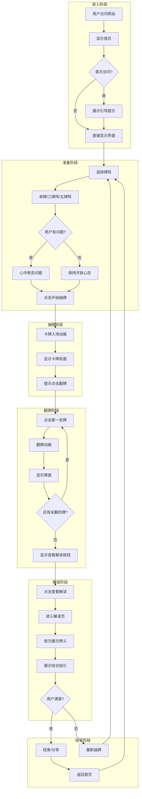

### 1.2 简化流程（快速路径）

**关键指标**：从进入到完成解读 < 90秒

---

## 二、页面级用户流程

### 2.1 首页 (HomeView) 流程

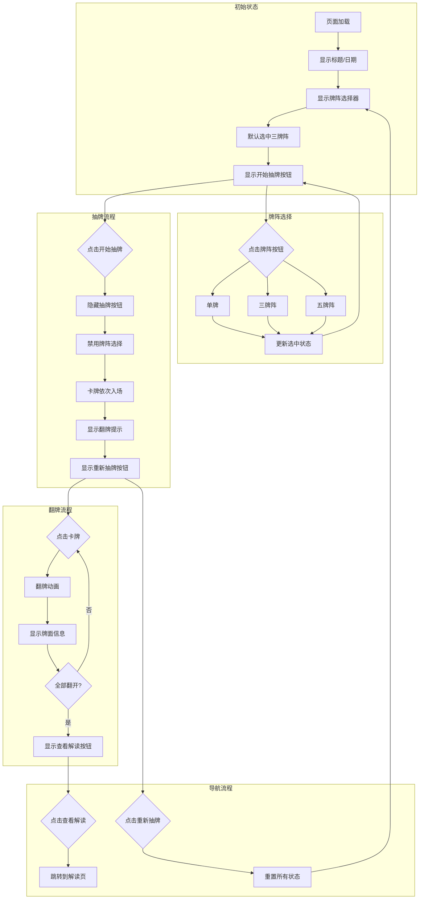

### 2.2 解读页 (ReadingView) 流程

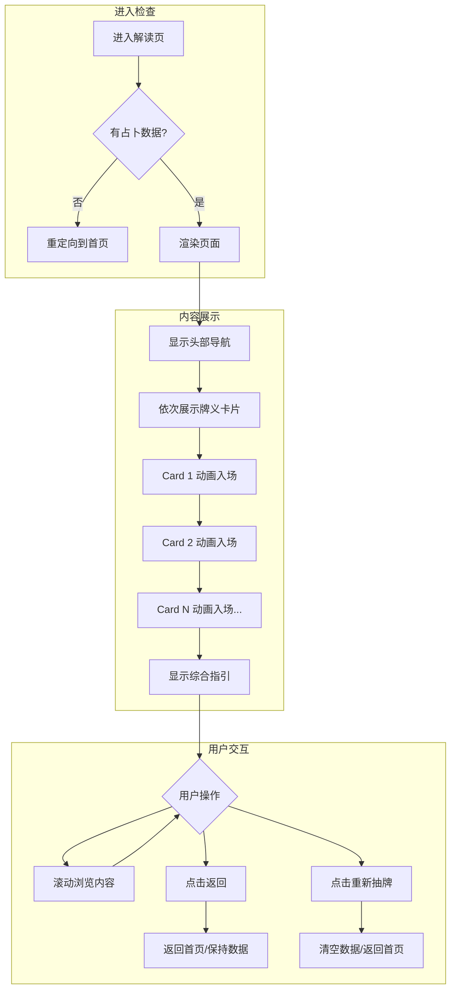

### 2.3 牌库 (LibraryView) 流程

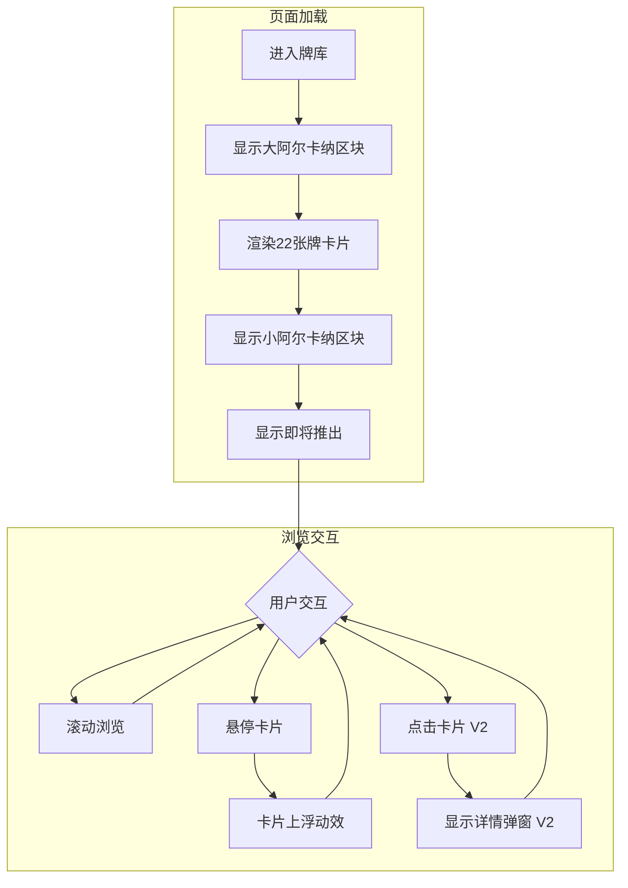

---

## 三、交互状态流转

### 3.1 卡牌状态机

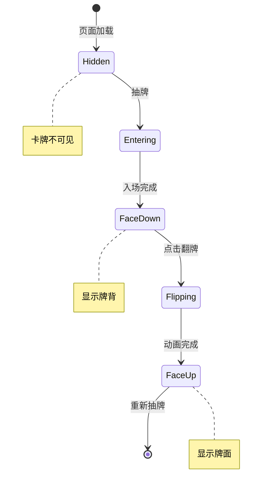

#### 状态详情

| 状态 | 视觉表现 | 可交互性 |
|------|----------|----------|
| Hidden | 不显示 | 无 |
| Entering | 入场动画中 | 不可点击 |
| FaceDown | 显示牌背 | 可点击翻牌 |
| Flipping | 翻转动画中 | 不可点击 |
| FaceUp | 显示牌面 | 无需交互 |

### 3.2 按钮状态流转

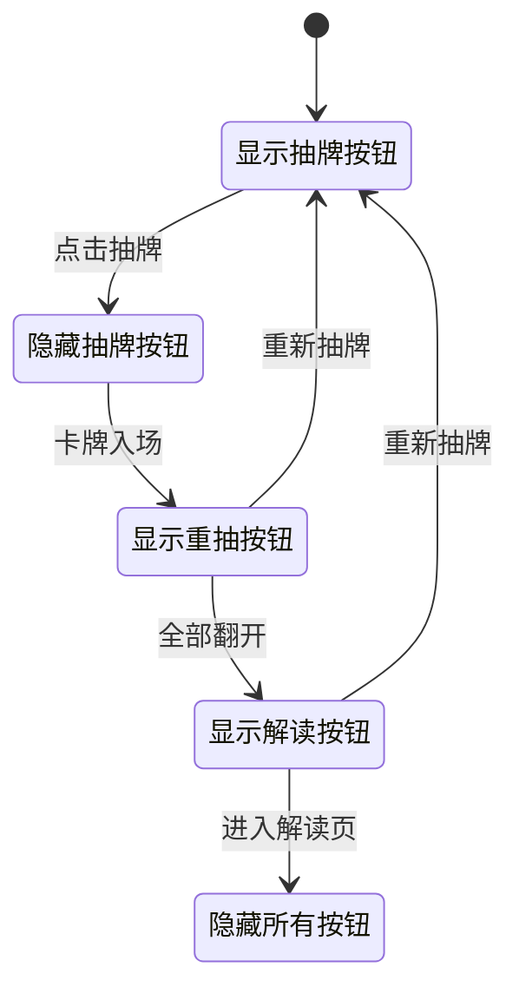

---

## 四、错误处理流程

### 4.1 网络错误处理

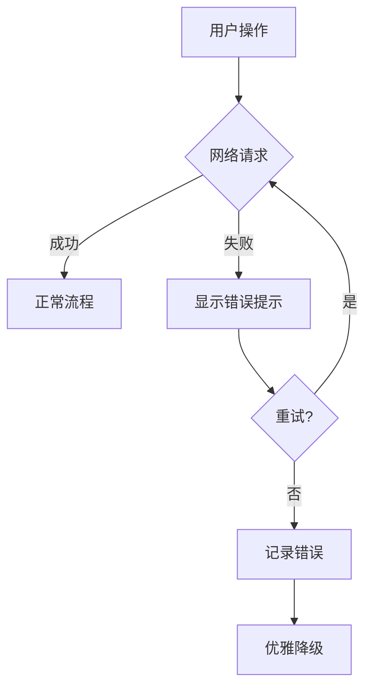

### 4.2 数据异常处理

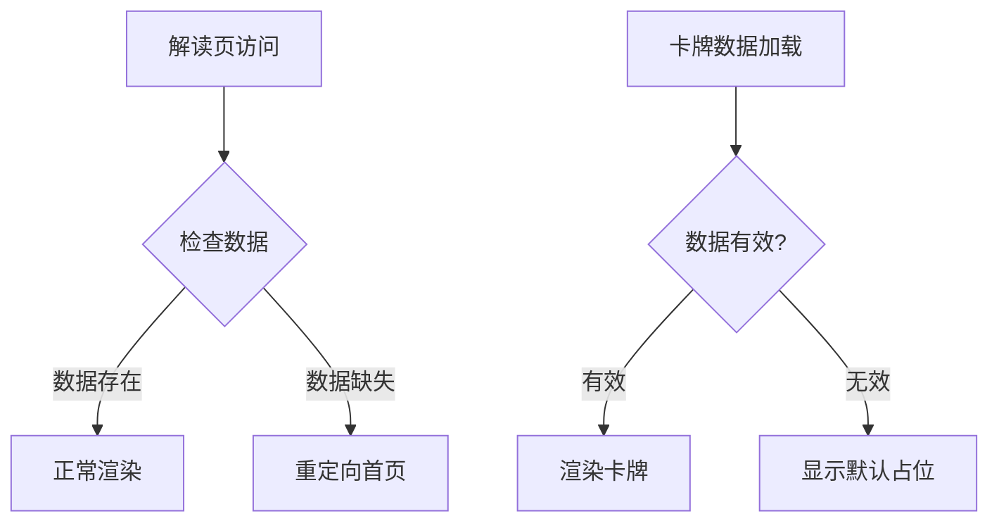

---

## 五、V2 功能流程预览

### 5.1 每日塔罗流程

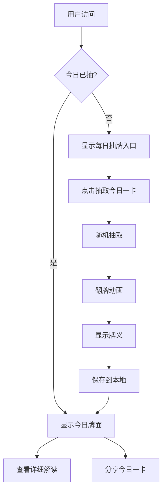

### 5.2 AI 解读流程

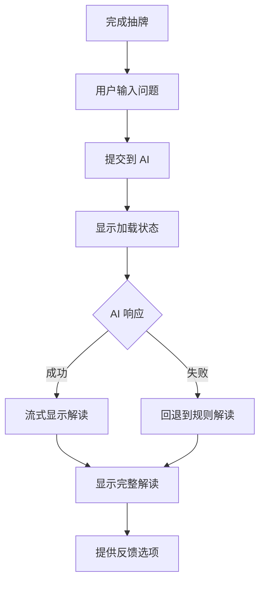

### 5.3 分享流程

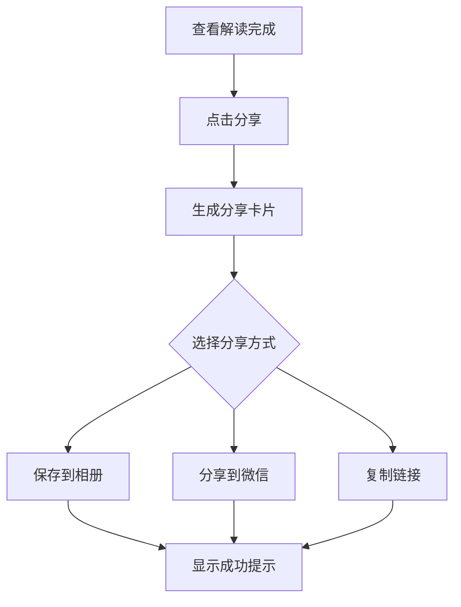

---

## 六、性能关键路径

### 6.1 首屏渲染路径

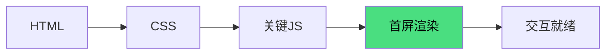

**目标**：FCP < 1.5s, TTI < 3s

### 6.2 占卜完成路径

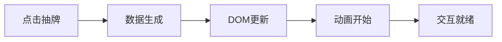

**目标**：从点击到动画开始 < 100ms

---

## 七、可访问性流程

### 7.1 键盘导航流程

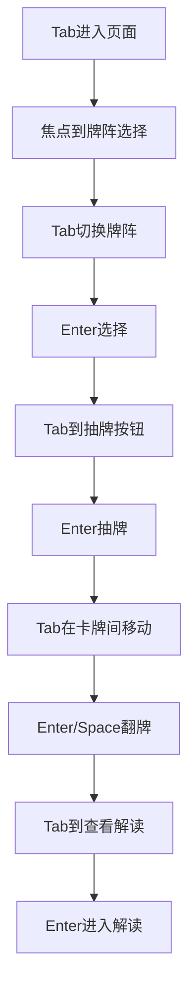

### 7.2 屏幕阅读器流程

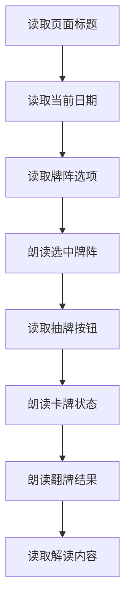
