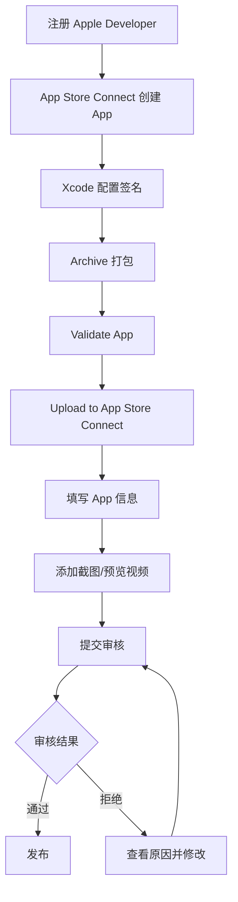
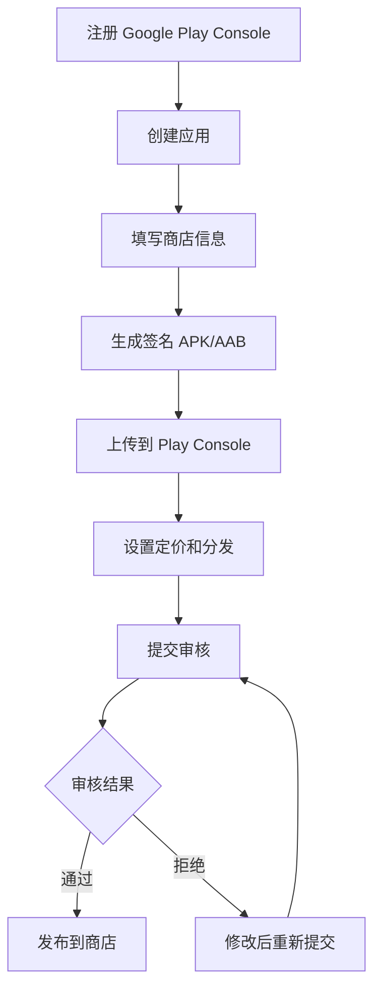

# BlackRice Tarot - 移动端发布指南

> 版本：1.0  
> 更新日期：2026-03-11  
> 技术方案：Capacitor

---

## 一、技术方案

### 1.1 为什么选择 Capacitor

| 优势 | 说明 |
|------|------|
| **零迁移成本** | 现有 Vite + Vue 3 代码无需修改 |
| **前端友好** | Web 应用直接打包成原生 App |
| **原生能力** | 通过插件访问设备 API |
| **热更新** | 可绑定远程 URL 实现动态更新 |
| **社区活跃** | Ionic 团队维护，插件生态丰富 |

### 1.2 方案对比

| 方案 | 代码复用 | 原生能力 | 学习成本 | 推荐度 |
|------|:--------:|:--------:|:--------:|:------:|
| **Capacitor** | ✅ 100% | 中 | 低 | ⭐⭐⭐⭐⭐ |
| Tauri Mobile | ✅ 100% | 高 | 中 | ⭐⭐⭐⭐ |
| PWA | ✅ 100% | 低 | 极低 | ⭐⭐⭐ |
| uni-app | ⚠️ 需迁移 | 高 | 中 | ⭐⭐⭐ |
| React Native | ❌ 重写 | 高 | 高 | ⭐⭐ |

---

## 二、环境准备

### 2.1 通用依赖

```bash
# Node.js 18+
node -v

# pnpm
pnpm -v
```

### 2.2 iOS 开发环境（需要 Mac）

| 工具 | 说明 | 安装方式 |
|------|------|----------|
| Xcode | iOS 开发 IDE | App Store |
| CocoaPods | iOS 依赖管理 | `sudo gem install cocoapods` |
| Apple Developer 账号 | 上架必需 | $99/年 |

### 2.3 Android 开发环境

| 工具 | 说明 | 安装方式 |
|------|------|----------|
| Android Studio | Android IDE | 官网下载 |
| Android SDK | 开发套件 | Android Studio 内置 |
| JDK 17+ | Java 环境 | Android Studio 内置 |
| Google Play 账号 | 上架必需 | $25 一次性 |

### 2.4 Windows 用户 iOS 方案

| 方案 | 成本 | 说明 |
|------|------|------|
| **Codemagic CI** | 免费额度 | 云端构建，推荐 |
| 云 Mac (MacStadium) | $50+/月 | 远程 Mac |
| 二手 Mac Mini | ¥2000+ | 一次性投入 |

---

## 三、Capacitor 集成

### 3.1 安装依赖

```bash
# 核心包
pnpm add @capacitor/core
pnpm add -D @capacitor/cli

# 初始化
npx cap init "BlackRice Tarot" "com.blackrice.tarot" --web-dir dist

# 添加平台
pnpm add @capacitor/ios @capacitor/android
npx cap add ios
npx cap add android
```

### 3.2 配置文件

```typescript
// capacitor.config.ts
import type { CapacitorConfig } from '@capacitor/cli'

const config: CapacitorConfig = {
  appId: 'com.blackrice.tarot',
  appName: 'BlackRice Tarot',
  webDir: 'dist',
  server: {
    androidScheme: 'https'
  },
  ios: {
    contentInset: 'automatic'
  },
  plugins: {
    SplashScreen: {
      launchAutoHide: true,
      backgroundColor: '#1a1a2e',
      androidSplashResourceName: 'splash',
      androidScaleType: 'CENTER_CROP',
      showSpinner: false,
      splashFullScreen: true,
      splashImmersive: true
    },
    StatusBar: {
      style: 'dark',
      backgroundColor: '#1a1a2e'
    }
  }
}

export default config
```

### 3.3 项目结构变化

```
tarot/
├── src/                    # Vue 代码（不变）
├── dist/                   # 构建产物
├── ios/                    # iOS 原生项目（自动生成）
│   ├── App/
│   │   ├── App/
│   │   │   ├── Assets.xcassets/   # 图标资源
│   │   │   └── Info.plist         # 应用配置
│   │   └── App.xcworkspace        # Xcode 工作区
│   └── Podfile                    # CocoaPods 依赖
├── android/                # Android 原生项目（自动生成）
│   ├── app/
│   │   ├── src/main/
│   │   │   ├── res/              # 资源文件
│   │   │   └── AndroidManifest.xml
│   │   └── build.gradle
│   └── build.gradle
└── capacitor.config.ts     # Capacitor 配置
```

---

## 四、常用插件

### 4.1 推荐插件清单

| 插件 | 包名 | 用途 |
|------|------|------|
| 震动反馈 | `@capacitor/haptics` | 翻牌、洗牌触觉 |
| 本地存储 | `@capacitor/preferences` | 图鉴、历史记录 |
| 分享 | `@capacitor/share` | 闪卡分享 |
| 状态栏 | `@capacitor/status-bar` | 沉浸式状态栏 |
| 启动屏 | `@capacitor/splash-screen` | 启动动画 |
| App 信息 | `@capacitor/app` | 版本检测 |
| 设备信息 | `@capacitor/device` | 平台检测 |

### 4.2 安装示例

```bash
# 震动反馈（翻牌时触发）
pnpm add @capacitor/haptics

# 本地存储（替代 localStorage）
pnpm add @capacitor/preferences

# 分享功能
pnpm add @capacitor/share

# 状态栏控制
pnpm add @capacitor/status-bar

# 启动屏
pnpm add @capacitor/splash-screen
```

### 4.3 使用示例

```typescript
// composables/useNative.ts
import { Capacitor } from '@capacitor/core'
import { Haptics, ImpactStyle } from '@capacitor/haptics'
import { Share } from '@capacitor/share'
import { Preferences } from '@capacitor/preferences'

export function useNative() {
  const isNative = Capacitor.isNativePlatform()
  const platform = Capacitor.getPlatform() // 'ios' | 'android' | 'web'

  // 震动反馈
  async function hapticFeedback(style: 'light' | 'medium' | 'heavy' = 'medium') {
    if (!isNative) return
    await Haptics.impact({ style: ImpactStyle[style.charAt(0).toUpperCase() + style.slice(1)] })
  }

  // 分享
  async function shareCard(title: string, imageUrl: string) {
    await Share.share({
      title,
      text: '我在 BlackRice Tarot 抽到了这张牌！',
      url: imageUrl,
      dialogTitle: '分享塔罗牌'
    })
  }

  // 本地存储
  async function saveData(key: string, value: any) {
    await Preferences.set({ key, value: JSON.stringify(value) })
  }

  async function loadData<T>(key: string): Promise<T | null> {
    const { value } = await Preferences.get({ key })
    return value ? JSON.parse(value) : null
  }

  return {
    isNative,
    platform,
    hapticFeedback,
    shareCard,
    saveData,
    loadData
  }
}
```

---

## 五、开发流程

### 5.1 日常开发

```bash
# 1. Web 开发（主要工作）
pnpm dev

# 2. 构建
pnpm build

# 3. 同步到原生项目
npx cap sync

# 4. 打开原生 IDE
npx cap open ios      # Xcode
npx cap open android  # Android Studio
```

### 5.2 开发命令

```json
// package.json scripts
{
  "scripts": {
    "dev": "vite",
    "build": "vue-tsc && vite build",
    "cap:sync": "cap sync",
    "cap:ios": "cap open ios",
    "cap:android": "cap open android",
    "app:ios": "pnpm build && cap sync ios && cap open ios",
    "app:android": "pnpm build && cap sync android && cap open android"
  }
}
```

### 5.3 实时调试

```typescript
// capacitor.config.ts (开发模式)
const config: CapacitorConfig = {
  // ...
  server: {
    // 开发时连接本地服务器
    url: 'http://192.168.1.100:5173', // 你的本地 IP
    cleartext: true
  }
}
```

---

## 六、App 资源准备

### 6.1 iOS 图标尺寸

| 用途 | 尺寸 (px) | 文件名 |
|------|-----------|--------|
| App Store | 1024×1024 | AppIcon-1024.png |
| iPhone | 180×180 | AppIcon-60@3x.png |
| iPhone | 120×120 | AppIcon-60@2x.png |
| iPad | 167×167 | AppIcon-83.5@2x.png |
| iPad | 152×152 | AppIcon-76@2x.png |
| Spotlight | 120×120 | AppIcon-40@3x.png |
| Settings | 87×87 | AppIcon-29@3x.png |

### 6.2 Android 图标尺寸

| 密度 | 尺寸 (px) | 目录 |
|------|-----------|------|
| mdpi | 48×48 | mipmap-mdpi |
| hdpi | 72×72 | mipmap-hdpi |
| xhdpi | 96×96 | mipmap-xhdpi |
| xxhdpi | 144×144 | mipmap-xxhdpi |
| xxxhdpi | 192×192 | mipmap-xxxhdpi |

### 6.3 启动屏

```
ios/App/App/Assets.xcassets/Splash.imageset/
├── splash-2732x2732.png    # iPad Pro
├── splash-1792x1792.png    # iPhone 横屏
└── Contents.json

android/app/src/main/res/
├── drawable/splash.png
├── drawable-hdpi/splash.png
├── drawable-xhdpi/splash.png
├── drawable-xxhdpi/splash.png
└── drawable-xxxhdpi/splash.png
```

---

## 七、上架流程

### 7.0 i18n 国际化（App Store 必需）

> ⚠️ **重要**：上架 App Store 面向全球市场，必须支持至少中英双语

#### 安装配置

```bash
# 安装 vue-i18n
pnpm add vue-i18n
```

```typescript
// src/i18n/index.ts
import { createI18n } from 'vue-i18n'
import zh from './locales/zh.json'
import en from './locales/en.json'

export const i18n = createI18n({
  legacy: false,
  locale: navigator.language.startsWith('zh') ? 'zh' : 'en',
  fallbackLocale: 'en',
  messages: { zh, en }
})
```

#### 语言文件结构

```
src/i18n/
├── index.ts              # i18n 配置
└── locales/
    ├── zh.json           # 中文
    ├── en.json           # 英文
    └── cards/
        ├── major-zh.json # 大阿尔卡纳中文牌义
        ├── major-en.json # 大阿尔卡纳英文牌义
        ├── minor-zh.json # 小阿尔卡纳中文牌义
        └── minor-en.json # 小阿尔卡纳英文牌义
```

#### 需要翻译的内容

| 内容 | 中文字数 | 优先级 |
|------|---------|:------:|
| UI 文案 | ~200 | P0 |
| 22 张大阿尔卡纳牌义 | ~3000 | P0 |
| 56 张小阿尔卡纳牌义 | ~8000 | P1 |
| 占卜小贴士 | ~500 | P2 |
| 免责声明/隐私政策 | ~500 | P0 |

#### App Store 本地化

```
App Store Connect 需要准备：
├── 中文 (简体)
│   ├── App 名称: 黑米塔罗
│   ├── 副标题: 沉浸式占卜体验
│   ├── 描述: 完整的 App 描述
│   ├── 关键词: 塔罗,占卜,运势,每日一卡...
│   └── 截图: 中文界面截图
└── English
    ├── App Name: BlackRice Tarot
    ├── Subtitle: Immersive Divination Experience
    ├── Description: Full app description
    ├── Keywords: tarot,divination,fortune,daily card...
    └── Screenshots: English UI screenshots
```

---

### 7.1 iOS App Store

#### 准备清单

| 项目 | 说明 | 状态 |
|------|------|:----:|
| Apple Developer 账号 | $99/年 | ⬜ |
| App ID (Bundle ID) | com.blackrice.tarot | ⬜ |
| 开发证书 | Development Certificate | ⬜ |
| 发布证书 | Distribution Certificate | ⬜ |
| Provisioning Profile | App Store 描述文件 | ⬜ |
| App 图标 | 全尺寸套件 | ⬜ |
| 启动屏 | 全尺寸套件 | ⬜ |
| **i18n 国际化** | 中英双语支持 | ⬜ |
| 截图 (中文) | 6.7", 6.5", 5.5", iPad Pro | ⬜ |
| 截图 (英文) | 6.7", 6.5", 5.5", iPad Pro | ⬜ |
| 隐私政策 URL | 中英双语 | ⬜ |

#### 审核注意事项

```markdown
⚠️ 塔罗类 App 上架注意：

1. **分类选择**
   - 主分类: Entertainment（娱乐）
   - 次分类: Lifestyle（生活方式）

2. **年龄分级**
   - 建议选择 12+（涉及神秘主题）

3. **免责声明**（必须包含）
   - "本应用仅供娱乐和自我反思用途"
   - "不提供任何形式的命运预测或决策建议"
   - "塔罗解读基于传统象征意义，供用户自行解读"

4. **避免的措辞**
   - ❌ "预测你的未来"
   - ❌ "准确率 99%"
   - ❌ "改变命运"
   - ✅ "探索内心"
   - ✅ "自我反思工具"
   - ✅ "娱乐体验"
```

#### 上架流程



### 7.2 Google Play

#### 准备清单

| 项目 | 说明 | 状态 |
|------|------|:----:|
| Google Play Console 账号 | $25 一次性 | ⬜ |
| 签名密钥 (keystore) | 自行生成 | ⬜ |
| App 图标 | 512×512 高清 | ⬜ |
| Feature Graphic | 1024×500 | ⬜ |
| 截图 | 手机 + 平板 | ⬜ |
| 隐私政策 URL | 必填 | ⬜ |

#### 生成签名密钥

```bash
# 生成 keystore
keytool -genkey -v -keystore blackrice-tarot.keystore \
  -alias blackrice -keyalg RSA -keysize 2048 -validity 10000

# 重要：备份此文件和密码！丢失将无法更新 App
```

#### 上架流程



---

## 八、CI/CD 自动构建

### 8.1 Codemagic 配置（推荐 Windows 用户）

```yaml
# codemagic.yaml
workflows:
  ios-workflow:
    name: iOS Production
    max_build_duration: 60
    environment:
      xcode: latest
      cocoapods: default
      groups:
        - app_store_credentials
      vars:
        BUNDLE_ID: com.blackrice.tarot
    scripts:
      - name: Install dependencies
        script: |
          npm install -g pnpm
          pnpm install
      - name: Build web
        script: pnpm build
      - name: Sync Capacitor
        script: npx cap sync ios
      - name: Install CocoaPods
        script: |
          cd ios/App
          pod install
      - name: Build IPA
        script: |
          cd ios/App
          xcode-project build-ipa \
            --workspace App.xcworkspace \
            --scheme App
    artifacts:
      - ios/App/build/ios/ipa/*.ipa
    publishing:
      app_store_connect:
        api_key: $APP_STORE_CONNECT_PRIVATE_KEY
        key_id: $APP_STORE_CONNECT_KEY_IDENTIFIER
        issuer_id: $APP_STORE_CONNECT_ISSUER_ID

  android-workflow:
    name: Android Production
    max_build_duration: 60
    environment:
      java: 17
      android_signing:
        - blackrice_keystore
    scripts:
      - name: Install dependencies
        script: |
          npm install -g pnpm
          pnpm install
      - name: Build web
        script: pnpm build
      - name: Sync Capacitor
        script: npx cap sync android
      - name: Build AAB
        script: |
          cd android
          ./gradlew bundleRelease
    artifacts:
      - android/app/build/outputs/bundle/release/*.aab
    publishing:
      google_play:
        credentials: $GCLOUD_SERVICE_ACCOUNT_CREDENTIALS
        track: production
```

### 8.2 GitHub Actions 配置

```yaml
# .github/workflows/build-mobile.yml
name: Build Mobile Apps

on:
  push:
    tags:
      - 'v*'

jobs:
  build-android:
    runs-on: ubuntu-latest
    steps:
      - uses: actions/checkout@v4
      
      - name: Setup Node.js
        uses: actions/setup-node@v4
        with:
          node-version: '20'
          
      - name: Setup pnpm
        uses: pnpm/action-setup@v2
        with:
          version: 8
          
      - name: Install dependencies
        run: pnpm install
        
      - name: Build web
        run: pnpm build
        
      - name: Sync Capacitor
        run: npx cap sync android
        
      - name: Setup Java
        uses: actions/setup-java@v4
        with:
          distribution: 'zulu'
          java-version: '17'
          
      - name: Build APK
        run: |
          cd android
          ./gradlew assembleRelease
          
      - name: Upload APK
        uses: actions/upload-artifact@v4
        with:
          name: app-release
          path: android/app/build/outputs/apk/release/*.apk
```

---

## 九、费用汇总

| 项目 | 费用 | 频率 | 必需性 |
|------|------|------|:------:|
| Apple Developer | $99 | 每年 | iOS 必需 |
| Google Play | $25 | 一次性 | Android 必需 |
| Mac 电脑 | ¥2000+ | 一次性 | iOS（可用云服务替代） |
| Codemagic CI | 免费额度 | - | 可选 |
| 域名（隐私政策） | ¥50+/年 | 每年 | 必需 |

**最低成本方案**：
- Android 发布：$25 ≈ ¥180
- iOS 发布（使用 Codemagic）：$99 ≈ ¥700/年
- **总计首年**：约 ¥900

---

## 十、推荐发布顺序

```
1. PWA 版本 ──────→ 零成本验证，可安装到桌面
       ↓
2. Android APK ───→ 门槛低，快速上架 Google Play
       ↓
3. iOS 版本 ──────→ 使用 Codemagic 云构建
       ↓
4. 持续迭代 ──────→ 热更新 Web 内容
```

---

## 十一、相关链接

- [Capacitor 官方文档](https://capacitorjs.com/docs)
- [Apple Developer](https://developer.apple.com/)
- [Google Play Console](https://play.google.com/console)
- [Codemagic CI/CD](https://codemagic.io/)
- [App 图标生成器](https://www.appicon.co/)

---

*最后更新：2026-03-11*
