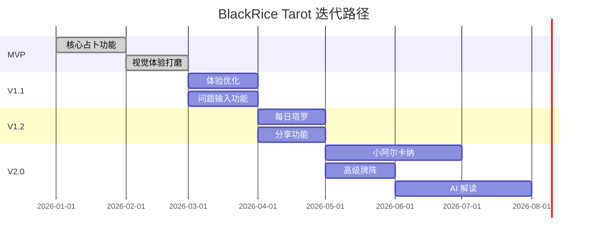
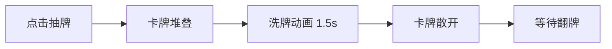
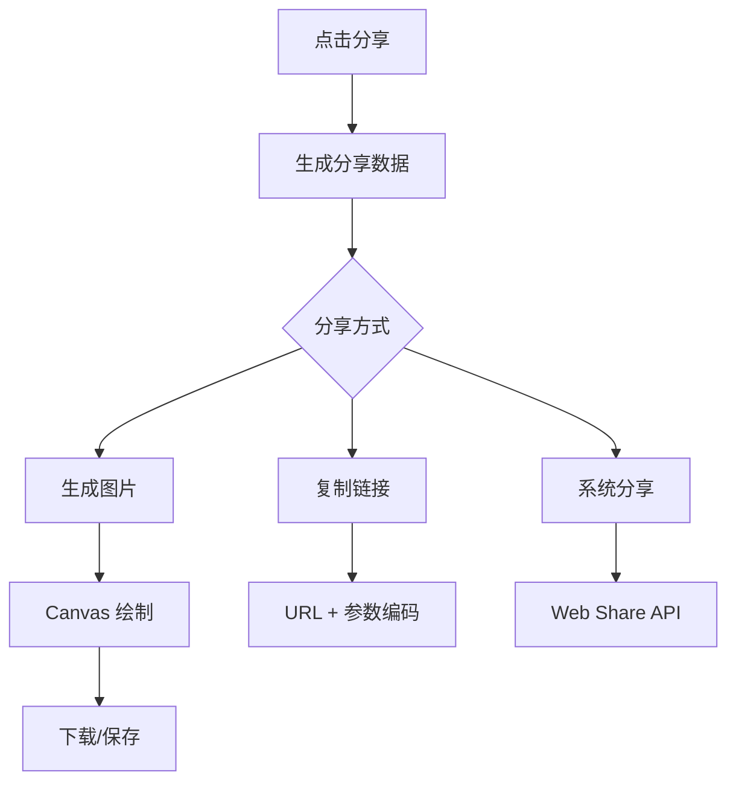
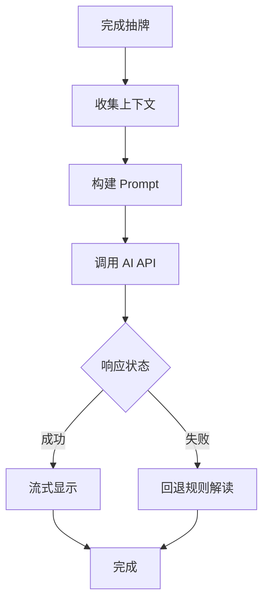
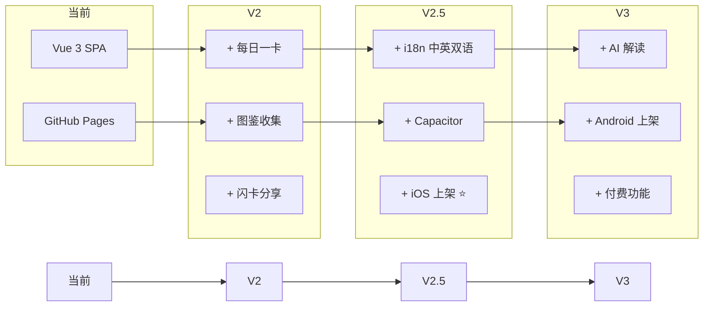

# BlackRice Tarot - 迭代路径

> 版本：1.0  
> 更新日期：2026-03-11

---

## 一、版本规划概览



---

## 二、MVP (v1.0) - 已完成 ✅

### 2.1 功能清单

| 功能 | 状态 | 说明 |
|------|------|------|
| 22张大阿尔卡纳数据 | ✅ | 完整牌义、关键词、描述 |
| 三种牌阵 | ✅ | 单牌、三牌阵、五牌阵 |
| 正逆位随机 | ✅ | 30%逆位概率 |
| 翻牌动画 | ✅ | 3D 翻转效果 |
| 卡牌入场动画 | ✅ | 渐入 + 缩放 |
| 解读面板 | ✅ | 牌义 + 综合指引 |
| 星空背景 | ✅ | 动态星星效果 |
| 响应式布局 | ✅ | PC + Mobile |
| 牌库浏览 | ✅ | 大阿尔卡纳展示 |
| 导航系统 | ✅ | 顶部/底部导航 |
| GitHub Pages 部署 | ✅ | 自动化部署 |

### 2.2 技术实现

- Vue 3 + TypeScript + Vite
- Tailwind CSS 样式系统
- Vue Router 路由管理
- Composables 状态管理
- motion-v 动画库

---

## 三、V1.1 - 体验优化

### 3.1 功能规划

| 功能 | 优先级 | 描述 |
|------|--------|------|
| 问题输入 | P1 | 用户可输入占卜问题，纳入解读 |
| 洗牌动画 | P1 | 抽牌前的洗牌视觉效果 |
| 引导优化 | P2 | 首次使用引导教程 |
| 音效反馈 | P3 | 翻牌、抽牌音效（可选） |
| 减少动效模式 | P2 | 支持 prefers-reduced-motion |

### 3.2 技术任务

```
□ 添加问题输入组件
□ 实现洗牌动画（CSS 或 Canvas）
□ 首次访问检测 + 引导弹窗
□ Web Audio API 音效系统
□ 媒体查询适配减少动效
□ 性能优化：图片懒加载
```

### 3.3 问题输入功能设计

```typescript
// 新增状态
interface TarotState {
  question: string | null  // 用户问题
  // ...existing
}

// 问题会影响综合指引生成
function generateSummary(cards, spreadType, question?) {
  let summary = '...'
  if (question) {
    summary = `关于「${question}」的指引：` + summary
  }
  return summary
}
```

### 3.4 洗牌动画方案



动画类型选项：
- **方案 A**：CSS Keyframes 简单位移
- **方案 B**：Canvas 物理洗牌
- **方案 C**：SVG 路径动画

推荐：**方案 A**，实现简单，性能好

---

## 四、V1.2 - 功能扩展

### 4.1 功能规划

| 功能 | 优先级 | 描述 |
|------|--------|------|
| 每日塔罗 | P1 | 每天抽取一张指引卡 |
| 分享功能 | P1 | 生成分享图片 |
| 抽牌历史 | P2 | 本地存储历史记录 |
| 牌详情弹窗 | P2 | 点击牌库卡片查看详情 |

### 4.2 每日塔罗功能设计

```typescript
// 数据结构
interface DailyCard {
  date: string        // 'YYYY-MM-DD'
  card: DrawnCard
  viewed: boolean
}

// 存储 Key
const DAILY_CARD_KEY = 'tarot_daily_card'

// 逻辑
function getDailyCard(): DailyCard {
  const today = new Date().toISOString().split('T')[0]
  const stored = localStorage.getItem(DAILY_CARD_KEY)
  
  if (stored) {
    const data = JSON.parse(stored)
    if (data.date === today) {
      return data
    }
  }
  
  // 生成新的每日卡
  const card = drawCards(1)[0]
  const daily = { date: today, card, viewed: false }
  localStorage.setItem(DAILY_CARD_KEY, JSON.stringify(daily))
  return daily
}
```

### 4.3 分享功能设计



技术方案：
- **图片生成**：html2canvas 或 dom-to-image
- **链接分享**：URL 参数编码牌面信息
- **系统分享**：navigator.share API

### 4.4 历史记录设计

```typescript
interface ReadingRecord {
  id: string
  timestamp: number
  spreadType: SpreadType
  question?: string
  cards: DrawnCard[]
  summary: string
}

// 存储限制
const MAX_HISTORY = 50

// 管理函数
function saveReading(record: ReadingRecord): void
function getHistory(): ReadingRecord[]
function deleteReading(id: string): void
function clearHistory(): void
```

---

## 五、V2.0 - 重大升级

### 5.1 功能规划

| 功能 | 优先级 | 描述 |
|------|--------|------|
| 56张小阿尔卡纳 | P1 | 完整 78 张牌 |
| 凯尔特十字牌阵 | P1 | 经典 10 牌阵 |
| AI 解读 | P1 | 个性化智能解读 |
| 牌面图片 | P2 | 韦特塔罗图片资源 |
| 关系牌阵 | P2 | 感情专用牌阵 |
| PWA 支持 | P3 | 离线使用、安装 |

### 5.2 小阿尔卡纳数据结构

```typescript
interface MinorArcanaCard extends TarotCard {
  suit: 'wands' | 'cups' | 'swords' | 'pentacles'
  rank: number | 'page' | 'knight' | 'queen' | 'king'
}

// 花色定义
const suits = {
  wands: { name: '权杖', element: '火', domain: '行动与创造' },
  cups: { name: '圣杯', element: '水', domain: '情感与关系' },
  swords: { name: '宝剑', element: '风', domain: '思想与冲突' },
  pentacles: { name: '金币', element: '土', domain: '物质与实际' }
}

// 宫廷牌等级
const courtCards = ['page', 'knight', 'queen', 'king']
```

### 5.3 凯尔特十字牌阵

```
        [3]
         |
    [5]-[1/2]-[6]
         |
        [4]
         
    [10]
    [9]
    [8]
    [7]

位置含义：
1. 现状 - 当前情况的核心
2. 障碍 - 横跨在 1 上，主要挑战
3. 潜意识 - 潜在的影响
4. 过去 - 近期过去的影响
5. 意识 - 当前的想法和目标
6. 近未来 - 即将发生的事
7. 自我 - 问卜者的态度
8. 环境 - 外部影响
9. 希望/恐惧 - 内心期望或担忧
10. 结果 - 最终走向
```

```typescript
export const celticCrossPositions = [
  '现状',
  '障碍',
  '潜意识',
  '过去',
  '意识目标',
  '近未来',
  '自我态度',
  '外部环境',
  '希望与恐惧',
  '最终结果'
]
```

### 5.4 AI 解读集成



#### Prompt 设计

```typescript
const systemPrompt = `你是一位经验丰富的塔罗牌解读师。
请基于以下原则进行解读：
1. 塔罗是反思工具，不是命运预测
2. 提供正向、建设性的指引
3. 即使困难牌也要给出希望
4. 结合各牌位置关系进行整体分析`

const userPrompt = `
问题：${question || '无特定问题'}
牌阵：${spreadType}
抽到的牌：
${cards.map(c => `- ${c.position}：${c.name}（${c.isReversed ? '逆位' : '正位'}）`).join('\n')}

请给出详细的解读和指引。
`
```

#### API 选项

| 提供商 | 模型 | 优势 | 劣势 |
|--------|------|------|------|
| OpenAI | GPT-4 | 质量最高 | 成本高 |
| Anthropic | Claude | 安全性好 | 需要代理 |
| Moonshot | Kimi | 中文优化 | 速度稍慢 |
| 本地 | Ollama | 无成本 | 需要部署 |

### 5.5 PWA 配置

```typescript
// vite.config.ts
import { VitePWA } from 'vite-plugin-pwa'

export default defineConfig({
  plugins: [
    vue(),
    VitePWA({
      registerType: 'autoUpdate',
      manifest: {
        name: 'BlackRice Tarot',
        short_name: 'Tarot',
        theme_color: '#1a1a2e',
        background_color: '#1a1a2e',
        display: 'standalone',
        icons: [
          { src: '/icon-192.png', sizes: '192x192', type: 'image/png' },
          { src: '/icon-512.png', sizes: '512x512', type: 'image/png' }
        ]
      },
      workbox: {
        globPatterns: ['**/*.{js,css,html,svg,png,woff2}']
      }
    })
  ]
})
```

---

## 六、V3.0+ - 远期规划

### 6.1 功能展望

| 功能 | 描述 | 技术方案 | 优先级 |
|------|------|----------|:------:|
| 🌍 i18n 国际化 | 中英双语 | vue-i18n | **P0** |
| 📱 iOS App | 上架 App Store | Capacitor + Codemagic CI | **P0** |
| 🤖 Android App | 上架 Google Play | Capacitor | P2 |
| 👤 用户账号 | 云端同步历史 | Supabase / Firebase | P2 |
| 💬 社区功能 | 分享、评论 | 后端 API | P3 |
| 💎 付费解读 | 高级 AI 解读 | App 内购 | P3 |
| 📦 闪卡盲盒 | 付费收集系统 | App 内购 | P3 |

> ⚠️ **策略**：iOS 优先上架，Android 后续跟进
> 
> 移动端发布详细指南见 [MOBILE-RELEASE.md](./MOBILE-RELEASE.md)

### 6.2 技术升级路径



---

## 七、技术债务清单

### 7.1 当前债务

| 债务 | 影响 | 优先级 | 计划版本 |
|------|------|--------|----------|
| 无单元测试 | 回归风险 | 中 | V1.1 |
| 无 E2E 测试 | 集成风险 | 低 | V2.0 |
| 硬编码配置 | 扩展困难 | 低 | V1.2 |
| 无错误监控 | 问题发现慢 | 中 | V1.2 |

### 7.2 偿还计划

```
V1.1:
  - 添加 Vitest 单元测试框架
  - 核心函数测试覆盖

V1.2:
  - 配置外部化（环境变量）
  - 接入 Sentry 错误监控

V2.0:
  - Playwright E2E 测试
  - CI 测试流水线
```

---

## 八、里程碑检查点

### 8.1 V1.1 发布标准

- [ ] 问题输入功能完成
- [ ] 洗牌动画实现
- [ ] 性能指标达标（LCP < 2.5s）
- [ ] 无 P0/P1 Bug
- [ ] 文档更新

### 8.2 V1.2 发布标准

- [ ] 每日塔罗功能完成
- [ ] 分享功能可用
- [ ] 历史记录功能完成
- [ ] 用户测试反馈处理
- [ ] 无 P0/P1 Bug

### 8.3 V2.0 发布标准

- [ ] 78张牌数据完整
- [ ] 凯尔特十字牌阵可用
- [ ] AI 解读集成
- [ ] PWA 安装可用
- [ ] 性能测试通过
- [ ] 安全审计通过
