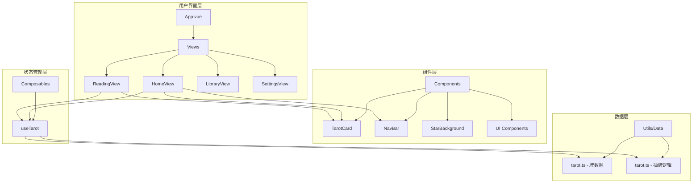
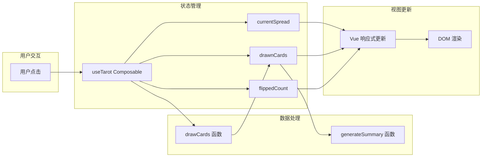

# BlackRice Tarot - 技术架构

> 版本：1.0  
> 更新日期：2026-03-11

---

## 一、技术栈概览

### 1.1 核心技术

| 技术 | 版本 | 用途 | 选型理由 |
|------|------|------|----------|
| Vue | 3.4+ | UI 框架 | 组合式 API、响应式系统、生态完善 |
| TypeScript | 5.x | 类型安全 | 编译时检查、IDE 支持、代码可维护性 |
| Vite | 5.x | 构建工具 | 极速 HMR、原生 ESM、简洁配置 |
| Tailwind CSS | 3.x | 样式方案 | 原子化 CSS、高度可定制、生产体积小 |
| Vue Router | 4.x | 路由管理 | 官方路由、支持动态路由、导航守卫 |

### 1.2 辅助库

| 库 | 版本 | 用途 |
|----|------|------|
| motion-v | latest | 动画库（Vue 版 Framer Motion） |
| lucide-vue-next | latest | 图标库 |
| clsx | latest | 条件类名合并 |
| tailwind-merge | latest | Tailwind 类名去重 |

### 1.3 开发工具

| 工具 | 用途 |
|------|------|
| pnpm | 包管理器（快速、节省磁盘） |
| ESLint | 代码检查 |
| Prettier | 代码格式化 |
| TypeScript | 类型检查 |

---

## 二、项目架构

### 2.1 目录结构

```
tarot/
├── .cursor/                    # Cursor IDE 配置
│   └── context.md              # 项目上下文
├── .github/
│   └── workflows/
│       └── deploy.yml          # GitHub Actions 自动部署
├── docs/                       # 产品与技术文档
│   ├── product/                # 产品文档
│   ├── technical/              # 技术文档
│   └── reference/              # 参考资料
├── public/
│   └── favicon.svg             # 网站图标
├── src/
│   ├── components/             # 组件
│   │   ├── ui/                 # 基础 UI 组件
│   │   │   └── button.vue
│   │   ├── TarotCard.vue       # 塔罗牌卡片
│   │   ├── StarBackground.vue  # 星空背景
│   │   ├── NavBar.vue          # 导航栏
│   │   ├── TipsBox.vue         # 提示框
│   │   └── AppFooter.vue       # 页脚
│   ├── composables/            # 组合式函数
│   │   └── useTarot.ts         # 塔罗状态管理
│   ├── lib/                    # 工具库
│   │   └── utils.ts            # 通用工具函数
│   ├── router/                 # 路由配置
│   │   └── index.ts
│   ├── utils/                  # 业务工具
│   │   └── tarot.ts            # 塔罗牌数据与逻辑
│   ├── views/                  # 页面视图
│   │   ├── HomeView.vue        # 首页
│   │   ├── ReadingView.vue     # 解读页
│   │   ├── LibraryView.vue     # 牌库页
│   │   └── SettingsView.vue    # 设置页
│   ├── App.vue                 # 根组件
│   ├── main.ts                 # 入口文件
│   ├── style.css               # 全局样式
│   └── vite-env.d.ts           # Vite 类型声明
├── index.html                  # HTML 入口
├── package.json                # 依赖配置
├── pnpm-lock.yaml              # 依赖锁定
├── postcss.config.js           # PostCSS 配置
├── tailwind.config.js          # Tailwind 配置
├── tsconfig.json               # TypeScript 配置
├── tsconfig.node.json          # Node TypeScript 配置
└── vite.config.ts              # Vite 配置
```

### 2.2 架构图



### 2.3 数据流



---

## 三、核心模块设计

### 3.1 状态管理 (useTarot)

```typescript
// src/composables/useTarot.ts
import { ref, computed } from 'vue'
import { drawCards as draw, generateSummary, spreadPositions, type SpreadType, type DrawnCard } from '@/utils/tarot'

// 全局状态（单例）
const currentSpread = ref<SpreadType>(3)
const drawnCards = ref<DrawnCard[]>([])
const flippedCount = ref(0)

export function useTarot() {
  // 计算属性
  const isDrawn = computed(() => drawnCards.value.length > 0)
  const allFlipped = computed(() => 
    isDrawn.value && flippedCount.value >= drawnCards.value.length
  )
  const positions = computed(() => spreadPositions[currentSpread.value])
  const summary = computed(() => 
    generateSummary(drawnCards.value, currentSpread.value)
  )

  // 操作方法
  function selectSpread(type: SpreadType) {
    if (!isDrawn.value) {
      currentSpread.value = type
    }
  }

  function drawCards() {
    drawnCards.value = draw(currentSpread.value)
    flippedCount.value = 0
  }

  function flipCard() {
    if (flippedCount.value < drawnCards.value.length) {
      flippedCount.value++
    }
  }

  function resetReading() {
    drawnCards.value = []
    flippedCount.value = 0
  }

  return {
    currentSpread,
    drawnCards,
    flippedCount,
    isDrawn,
    allFlipped,
    positions,
    summary,
    selectSpread,
    drawCards,
    flipCard,
    resetReading
  }
}
```

### 3.2 塔罗牌数据模块

```typescript
// src/utils/tarot.ts

// 类型定义
export interface TarotCard {
  id: string
  number: string
  name: string
  nameEn: string
  keywords: string
  symbol: string
  upright: string
  reversed: string
  description?: string
  note?: string
}

export interface DrawnCard extends TarotCard {
  isReversed: boolean
  position: string
}

export type SpreadType = 1 | 3 | 5

// 配置常量
export const REVERSED_PROBABILITY = 0.3

export const spreadPositions: Record<SpreadType, string[]> = {
  1: ['今日指引'],
  3: ['过去', '现在', '未来'],
  5: ['现状', '挑战', '过去', '未来', '建议']
}

// 核心函数
export function drawCards(count: SpreadType): DrawnCard[]
export function generateSummary(cards: DrawnCard[], spreadType: SpreadType): string
```

### 3.3 路由配置

```typescript
// src/router/index.ts
import { createRouter, createWebHistory } from 'vue-router'

const routes = [
  {
    path: '/',
    name: 'home',
    component: () => import('@/views/HomeView.vue'),
    meta: { title: '占卜' }
  },
  {
    path: '/reading',
    name: 'reading',
    component: () => import('@/views/ReadingView.vue'),
    meta: { title: '解读', requiresReading: true }
  },
  {
    path: '/library',
    name: 'library',
    component: () => import('@/views/LibraryView.vue'),
    meta: { title: '牌库' }
  },
  {
    path: '/settings',
    name: 'settings',
    component: () => import('@/views/SettingsView.vue'),
    meta: { title: '设置' }
  }
]

const router = createRouter({
  history: createWebHistory(import.meta.env.BASE_URL),
  routes
})

export default router
```

---

## 四、样式系统

### 4.1 Tailwind 配置

```javascript
// tailwind.config.js
export default {
  content: ['./index.html', './src/**/*.{vue,js,ts,jsx,tsx}'],
  theme: {
    extend: {
      colors: {
        gold: {
          DEFAULT: '#ffd700',
          dark: '#c9a227',
          light: '#ffb347'
        },
        background: 'hsl(var(--background))',
        foreground: 'hsl(var(--foreground))',
        muted: {
          DEFAULT: 'hsl(var(--muted))',
          foreground: 'hsl(var(--muted-foreground))'
        }
      },
      borderRadius: {
        lg: 'var(--radius)',
        md: 'calc(var(--radius) - 2px)',
        sm: 'calc(var(--radius) - 4px)'
      }
    }
  },
  plugins: []
}
```

### 4.2 CSS 变量系统

```css
/* src/style.css */
:root {
  --background: 222 47% 11%;
  --foreground: 36 33% 85%;
  --muted: 222 47% 20%;
  --muted-foreground: 220 9% 65%;
  --primary: 51 100% 50%;
  --primary-foreground: 222 47% 11%;
  --border: 51 100% 50% / 0.15;
  --radius: 0.75rem;
  --gold: #ffd700;
  --gold-dark: #c9a227;
  --gold-light: #ffb347;
  --nav-height: 60px;
}
```

---

## 五、构建与部署

### 5.1 Vite 配置

```typescript
// vite.config.ts
import { defineConfig } from 'vite'
import vue from '@vitejs/plugin-vue'
import { fileURLToPath, URL } from 'node:url'

export default defineConfig({
  plugins: [vue()],
  base: '/tarot/',  // GitHub Pages 部署路径
  resolve: {
    alias: {
      '@': fileURLToPath(new URL('./src', import.meta.url))
    }
  },
  build: {
    target: 'es2015',
    minify: 'terser',
    rollupOptions: {
      output: {
        manualChunks: {
          'vue-vendor': ['vue', 'vue-router'],
          'animation': ['motion-v']
        }
      }
    }
  }
})
```

### 5.2 GitHub Actions 部署

```yaml
# .github/workflows/deploy.yml
name: Deploy to GitHub Pages

on:
  push:
    branches: ['main']
  workflow_dispatch:

permissions:
  contents: read
  pages: write
  id-token: write

jobs:
  build:
    runs-on: ubuntu-latest
    steps:
      - uses: actions/checkout@v4
      - uses: pnpm/action-setup@v2
        with:
          version: 9
      - uses: actions/setup-node@v4
        with:
          node-version: 20
          cache: 'pnpm'
      - run: pnpm install
      - run: pnpm build
      - uses: actions/upload-pages-artifact@v3
        with:
          path: ./dist

  deploy:
    environment:
      name: github-pages
      url: ${{ steps.deployment.outputs.page_url }}
    runs-on: ubuntu-latest
    needs: build
    steps:
      - uses: actions/deploy-pages@v4
        id: deployment
```

---

## 六、性能优化策略

### 6.1 构建优化

| 策略 | 实现方式 | 效果 |
|------|----------|------|
| 代码分割 | 路由级懒加载 | 首屏体积减小 |
| Tree Shaking | ES Module + Vite | 移除未使用代码 |
| 压缩 | Terser minify | 减小产物体积 |
| 依赖分包 | manualChunks | 利用浏览器缓存 |

### 6.2 运行时优化

| 策略 | 实现方式 | 效果 |
|------|----------|------|
| 响应式优化 | shallowRef 大数组 | 减少响应式开销 |
| 动画优化 | CSS transform | GPU 加速 |
| 懒加载 | 图片 loading="lazy" | 按需加载 |

### 6.3 性能指标目标

| 指标 | 目标值 | 当前状态 |
|------|--------|----------|
| FCP | < 1.5s | ✅ |
| LCP | < 2.5s | ✅ |
| TTI | < 3s | ✅ |
| Bundle Size | < 200KB (gzip) | ✅ |

---

## 七、开发规范

### 7.1 命名规范

| 类型 | 规范 | 示例 |
|------|------|------|
| 组件文件 | PascalCase | `TarotCard.vue` |
| Composable | camelCase + use 前缀 | `useTarot.ts` |
| 工具函数 | camelCase | `drawCards()` |
| 类型/接口 | PascalCase | `TarotCard` |
| CSS 类 | kebab-case | `glass-card` |

### 7.2 组件规范

```vue
<script setup lang="ts">
// 1. 导入
import { ref, computed } from 'vue'

// 2. Props 定义
const props = defineProps<{
  card: TarotCard
  position: string
}>()

// 3. Emits 定义
const emit = defineEmits<{
  flip: []
}>()

// 4. 状态
const isFlipped = ref(false)

// 5. 计算属性
const displayName = computed(() => props.card.name)

// 6. 方法
function handleClick() {
  emit('flip')
}
</script>

<template>
  <!-- 单根元素 -->
</template>

<style scoped>
/* 作用域样式 */
</style>
```

### 7.3 Git 提交规范

```
<type>(<scope>): <subject>

类型:
- feat: 新功能
- fix: 修复
- docs: 文档
- style: 格式
- refactor: 重构
- perf: 性能
- test: 测试
- chore: 构建/工具

示例:
feat(card): 添加翻牌动画
fix(router): 修复解读页守卫
docs: 更新技术文档
```
