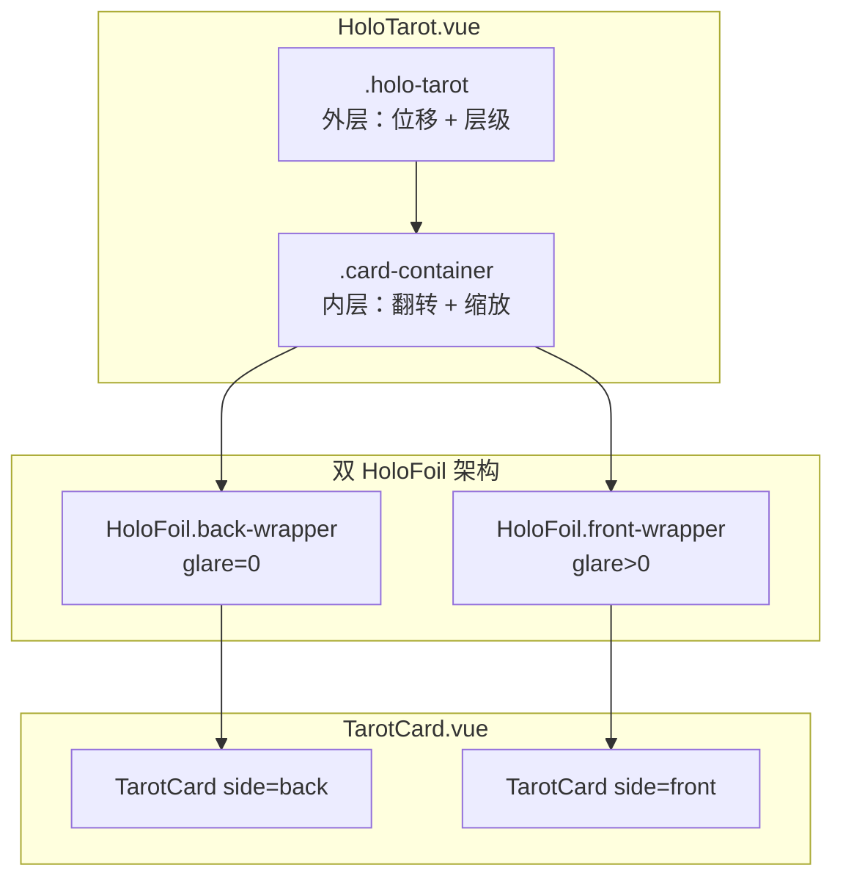

# 塔罗牌组件架构文档

## 目录结构

```
src/components/
├── tarot/                      # 塔罗牌核心组件
│   ├── HoloTarot.vue           # 主组件：翻转 + 放大 + 全息效果
│   ├── TarotCard.vue           # 纯渲染：卡面内容
│   ├── index.ts                # 导出
│   ├── card.html               # 独立 Demo（开发调试用）
│   └── card.README.md          # Demo 文档
│
└── holo/                       # 全息效果系统
    ├── HoloFoil.vue            # hover-tilt 包装组件
    ├── presets.ts              # 预设配置（7 种效果）
    ├── index.ts                # 导出
    └── effects/                # CSS 效果
        ├── index.css           # 汇总入口
        ├── gradients.css       # 渐变效果
        ├── shadows.css         # 阴影效果
        └── masks/              # 遮罩资源
            ├── aztec-pattern.webp
            ├── circuit-board.svg
            └── birthday-holo.webp
```

---

## 组件关系图



---

## 1. HoloTarot.vue — 主组件

### 1.1 双层架构

| 层级 | CSS 类 | 职责 | Transform |
|------|--------|------|-----------|
| **外层** | `.holo-tarot` | 位移到中心 + 层级控制 | `translate3d(x, y, 0)` |
| **内层** | `.card-container` | 3D 翻转 + 缩放 | `perspective() rotateY() scale()` |

**为什么需要双层？**

- 外层负责 `translate3d`（位移到屏幕中心）
- 内层负责 `rotateY` + `scale`（翻转和缩放）
- 两者使用不同的 `transition-timing-function`
- 分离后动画更自然，不会相互影响

### 1.2 状态机

```typescript
type CardState = 'back' | 'front' | 'zoom-in' | 'zoom-out'

// 状态流转
'back' → flip() → 'front' → zoomIn() → 'zoom-in' → zoomOut() → 'zoom-out' → 'front'
```

| 状态 | `.holo-tarot` | `.card-container` |
|------|---------------|-------------------|
| `back` | 无变换 | `perspective(800px)` |
| `front` | 无变换 | `perspective(800px) rotateY(180deg)` |
| `zoom-in` | `translate3d(x, y, 0)` + `z-index:99999` | `rotateY(540deg) scale(1.75)` |
| `zoom-out` | `translate3d(0, 0, 0)` + `z-index:99999` | `rotateY(180deg)` |

### 1.3 关键 CSS 实现

#### 双层架构 CSS

```css
/* 外层：控制位移到中心 */
.holo-tarot {
  position: relative;
  width: var(--card-width);
  aspect-ratio: var(--card-aspect-ratio);
  cursor: pointer;
  transition: transform var(--zoom-duration) cubic-bezier(0.25, 0.46, 0.45, 0.94);
}

.holo-tarot.zoom-in {
  transform: translate3d(var(--translate-x), var(--translate-y), 0);
  z-index: 99999;
  isolation: isolate;
}

.holo-tarot.zoom-out {
  transform: translate3d(0, 0, 0);
  z-index: 99999;
  isolation: isolate;
}

/* 内层：控制翻转 + 缩放 */
.card-container {
  position: relative;
  width: 100%;
  height: 100%;
  transform-style: preserve-3d;
  transform: perspective(800px);
  transition: transform var(--flip-duration) cubic-bezier(0.4, 0.2, 0.2, 1);
}

.card-container.flipped {
  transform: perspective(800px) rotateY(180deg);
}

.card-container.zoom-in {
  transform: perspective(800px) rotateY(540deg) scale(var(--zoom-scale));
  transition: transform var(--zoom-duration) cubic-bezier(0.25, 0.46, 0.45, 0.94);
}

.card-container.zoom-out {
  transform: perspective(800px) rotateY(180deg);
  transition: transform var(--zoom-duration) cubic-bezier(0.25, 0.46, 0.45, 0.94);
}
```

#### 3D 翻转卡面 (backface-visibility)

```css
.back-wrapper,
.front-wrapper {
  position: absolute;
  inset: 0;
  backface-visibility: hidden;  /* 关键：隐藏背面 */
}

.front-wrapper {
  transform: rotateY(180deg);   /* Front 面初始翻转 180° */
}
```

### 1.4 关键 JavaScript 实现

#### transitionend 替代 setTimeout

```typescript
const onTransitionEnd = (callback: () => void) => {
  const target = containerRef.value
  if (!target) {
    callback()
    return
  }

  const handler = (e: TransitionEvent) => {
    // 只监听 transform 属性，且必须是目标元素
    if (e.propertyName === 'transform' && e.target === target) {
      target.removeEventListener('transitionend', handler)
      callback()
    }
  }
  target.addEventListener('transitionend', handler)
}
```

**优点**：
- 更精确的动画同步
- 不依赖硬编码的时间值
- 自动适应 CSS duration 变化

#### 居中偏移计算

```typescript
const calcZoomOffset = () => {
  if (!rootRef.value) return

  const rect = rootRef.value.getBoundingClientRect()
  // 计算卡片中心到视口中心的偏移
  translateX.value = window.innerWidth / 2 - (rect.left + rect.width / 2)
  translateY.value = window.innerHeight / 2 - (rect.top + rect.height / 2)
}
```

#### 层级控制

```css
.holo-tarot.zoom-in,
.holo-tarot.zoom-out {
  z-index: 99999;
  isolation: isolate;  /* 创建新的堆叠上下文 */
}
```

**注意**：`isolation: isolate` 只能创建新堆叠上下文，无法突破 DOM 顺序。全局 CSS 中还需要：

```css
/* globals.css */
*:has(> .holo-tarot.zoom-in),
*:has(> .holo-tarot.zoom-out) {
  z-index: 99999 !important;
}
```

#### 全局点击关闭

```typescript
const zoomIn = () => {
  // ...
  onTransitionEnd(() => {
    // 使用 capture 阶段，确保优先捕获
    document.addEventListener('click', handleGlobalClick, { capture: true })
  })
}

const handleGlobalClick = (_: MouseEvent) => {
  zoomOut()
}
```

#### Tilt 效果刷新

翻转/缩放后，hover-tilt 需要重新计算位置：

```typescript
const triggerTilt = () => {
  if (!rootRef.value) return
  rootRef.value.dispatchEvent(
    new MouseEvent('mousemove', {
      clientX: lastMouseX,
      clientY: lastMouseY,
      bubbles: true,
    })
  )
}
```

### 1.5 CSS 变量

| 变量 | 默认值 | 用途 |
|------|--------|------|
| `--card-width` | `80px` (响应式) | 卡片宽度 |
| `--card-radius` | `8px` | 圆角 |
| `--card-aspect-ratio` | `0.585` | 宽高比 |
| `--flip-duration` | `700ms` | 翻转动画时长 |
| `--zoom-duration` | `800ms` | 缩放动画时长 |
| `--zoom-scale` | `1.75` | 放大比例 |
| `--translate-x` | `0px` | 水平位移（动态） |
| `--translate-y` | `0px` | 垂直位移（动态） |

### 1.6 Props 接口

```typescript
interface Props {
  card?: DrawnCard | TarotCardType  // 卡牌数据
  position?: string                  // 位置标签文字
  clickable?: boolean                // 是否可点击翻转 (默认 true)
  flipDuration?: number              // 翻转时长 ms (默认 700)
  zoomDuration?: number              // 缩放时长 ms (默认 800)
  spreadType?: SpreadType            // 牌阵类型（影响标签位置）
  holoPreset?: string                // 全息预设 (默认 'normal')
  deckId?: string                    // 牌组 ID
  gyroscope?: boolean                // 陀螺仪支持 (默认 true)
  static?: boolean                   // 静态模式（默认显示正面）
  flipped?: boolean                  // 初始翻转状态
  zoomable?: boolean                 // 是否可放大 (默认 true)
  zoomScale?: number                 // 放大比例 (默认 1.75)
}
```

### 1.7 Emits 事件

```typescript
const emit = defineEmits<{
  flip: [cardId: string]     // 开始翻转
  flipComplete: []           // 翻转完成
  click: []                  // 点击事件
  zoom: [zoomed: boolean]    // 放大/缩小状态变化
}>()
```

### 1.8 Expose 方法

```typescript
defineExpose({
  flip,          // 翻转
  reset,         // 重置状态
  zoomIn,        // 放大
  zoomOut,       // 缩小
  isFlipped,     // 是否已翻转 (computed)
  isFlipping,    // 是否正在翻转 (computed)
  isZoomed,      // 是否已放大 (computed)
  state,         // 当前状态 (ref)
})
```

---

## 2. HoloFoil.vue — hover-tilt 包装

### 2.1 hover-tilt 内部结构

```
<hover-tilt>
  #shadow-root
    <div part="container">   ← perspective
      <div part="tilt">      ← rotateX/Y + glare (::before)
        <slot />             ← 卡面内容
```

### 2.2 关键实现

#### Props 转换 (camelCase → kebab-case)

```typescript
const tiltProps = computed(() => {
  const cfg = presetConfig.value
  const glareIntensity = props.glareIntensity ?? cfg.glareIntensity ?? 1

  const result: Record<string, string> = {
    'tilt-factor': String(cfg.tiltFactor ?? 1),
    'scale-factor': String(cfg.scaleFactor ?? 1),
    'glare-intensity': String(glareIntensity),
    'glare-hue': String(cfg.glareHue ?? 270),
    'blend-mode': cfg.blendMode || 'overlay',
    // ...
  }

  // SpringOptions 需要 JSON 序列化
  result['spring-options'] = JSON.stringify(cfg.springOptions)
  result['tilt-spring-options'] = JSON.stringify(cfg.tiltSpringOptions)

  return result
})
```

#### 陀螺仪支持

```typescript
const handleDeviceOrientation = (event: DeviceOrientationEvent) => {
  const { beta, gamma } = event
  if (beta === null || gamma === null) return

  // 将设备角度映射到 0-1 范围
  simulatePointerEvent(
    Math.max(0, Math.min(1, (gamma + 45) / 90)),   // 左右倾斜
    Math.max(0, Math.min(1, (beta - 20) / 70)),    // 前后倾斜
    'move'
  )
}

const simulatePointerEvent = (x: number, y: number, type: 'enter' | 'move' | 'leave') => {
  // 获取 shadow DOM 内的 .hover-tilt 元素
  const tiltElement = hoverTiltRef.value.shadowRoot?.querySelector('.hover-tilt')
  
  const rect = tiltElement.getBoundingClientRect()
  tiltElement.dispatchEvent(
    new PointerEvent(/* ... */, {
      clientX: rect.left + x * rect.width,
      clientY: rect.top + y * rect.height,
      pointerType: 'touch',
    })
  )
}
```

### 2.3 CSS 样式

```css
/**
 * hover-tilt Web Component 内部结构：
 * <hover-tilt>
 *   #shadow-root
 *     <div part="container">   ← 提供 perspective
 *       <div part="tilt">      ← 应用 transform + glare (::before)
 *         <slot />
 *
 * 使用 ::part() 选择器样式化 shadow DOM 内部元素
 * @see https://hover-tilt.simey.me/options/css/
 */

/* 基础样式 */
hover-tilt.holo-foil {
  display: block;
  width: 100%;
  height: 100%;
}

/* Shadow DOM 内部样式 (::part) */

/* container: 提供 perspective，处理指针事件 */
hover-tilt.holo-foil::part(container) {
  width: 100%;
  height: 100%;
  border-radius: var(--card-radius, 8px);
}

/* tilt: 应用 transform，包含 glare (::before) */
hover-tilt.holo-foil::part(tilt) {
  width: 100%;
  height: 100%;
  border-radius: var(--card-radius, 8px);
  overflow: hidden;  /* 确保 glare (::before) 被裁剪 */
}

/* 交互层级 */
hover-tilt.holo-foil:hover {
  z-index: 10;
}
```

### 2.4 自定义渐变/阴影

hover-tilt 支持通过 CSS 变量自定义渐变和阴影，**必须设置在 `::part(container)` 上**：

```css
/* 自定义渐变 */
hover-tilt.my-gradient::part(container) {
  --hover-tilt-custom-gradient: linear-gradient(
    120deg,
    rgb(0 0 0 / 0) calc((var(--gradient-x, 50%) / 2 + var(--gradient-y, 50%) / 2) - 60%),
    rgb(249 218 173 / var(--hover-tilt-glare-intensity, 1))
      calc((var(--gradient-x, 50%) / 2 + var(--gradient-y, 50%) / 2)),
    rgb(0 0 0 / 0) calc((var(--gradient-x, 50%) / 2 + var(--gradient-y, 50%) / 2) + 60%)
  );
}

/* 自定义阴影 */
hover-tilt.my-shadow::part(container) {
  --hover-tilt-custom-shadow:
    hsl(270 60% 50% / calc(var(--hover-tilt-opacity, 0) * 0.35))
      calc((var(--hover-tilt-x, 0.5) - 0.5) * 8px)
      calc((var(--hover-tilt-y, 0.5) - 0.5) * 8px + 8px)
      calc(20px + var(--hover-tilt-opacity, 0) * 20px)
      0px;
}
```

---

## 3. TarotCard.vue — 纯渲染

### 3.1 职责

1. 渲染卡牌内容（正面或背面）
2. 支持图片牌组和 emoji 文字牌组
3. 图片加载失败时显示 fallback

**不负责**：
- 3D 翻转动画（由 HoloTarot 处理）
- tilt/glare 效果（由 HoloFoil 处理）

### 3.2 关键 CSS — 让内容在 glare 下方

```css
/**
 * 重要：使用 display: grid 实现层叠布局
 * 设置 z-index: -1 让内容在 hover-tilt 的 glare (::before) 之下
 * hover-tilt 的 glare 是通过 ::part(tilt)::before 实现的
 * 伪元素默认 z-index: auto，所以我们把内容设为负值
 */
.tarot-card {
  --card-radius: 8px;

  position: relative;
  z-index: -1;  /* 关键：确保在 hover-tilt glare 下方 */
  display: grid;
  width: 100%;
  height: 100%;
  border-radius: var(--card-radius);
  overflow: hidden;
  background: linear-gradient(180deg, #1a1a2e 0%, #0f0f1a 100%);
}

/* 所有直接子元素放在同一个 grid cell（层叠） */
.tarot-card > * {
  grid-area: 1 / 1;
}

.card-image {
  width: 100%;
  height: 100%;
  object-fit: cover;
  opacity: 0;
  transition: opacity 0.3s ease;
}

.card-image.loaded,
.back-image {
  opacity: 1;
}

.card-fallback {
  display: flex;
  flex-direction: column;
  align-items: center;
  justify-content: center;
  padding: 0.5rem;
  text-align: center;
  transition: opacity 0.3s ease;
}

.card-fallback.hidden {
  opacity: 0;
  pointer-events: none;
}
```

### 3.3 关键逻辑

#### 卡牌索引计算

```typescript
const cardIndex = computed(() => {
  if (!props.card?.id) return 0
  const id = props.card.id

  // 大阿卡纳：major-0 ~ major-21
  if (id.startsWith('major-')) {
    return parseInt(id.replace('major-', ''), 10) || 0
  }

  // 小阿卡纳：minor-{suit}-{rank}
  const match = id.match(/^minor-(\w+)-(.+)$/)
  if (match) {
    const [, suit, rank] = match
    const suitOffset = { wands: 22, cups: 36, swords: 50, pentacles: 64 }
    const courtRanks = { page: 11, knight: 12, queen: 13, king: 14 }
    const rankNum = courtRanks[rank] || parseInt(rank, 10)
    return (suitOffset[suit] || 22) + rankNum - 1
  }

  return 0
})
```

#### 图片 Fallback

```vue
<template>
  <div class="tarot-card">
    <!-- 正面：先尝试图片，失败显示 emoji -->
    <template v-if="showFront && card">
      
      
      <div v-if="!useImages || imageError || !imageLoaded" class="card-fallback">
        <span class="card-number">{{ cardNumber }}</span>
        <div class="card-symbol">{{ card.symbol }}</div>
        <span class="card-name">{{ card.name }}</span>
      </div>
    </template>

    <!-- 背面：固定图片 -->
    <template v-else>
      
    </template>
  </div>
</template>
```

---

## 4. presets.ts — 预设配置

### 4.1 预设结构

```typescript
interface HoloPreset {
  id: string
  name: { zh: string; en: string }
  description: { zh: string; en: string }

  // Interaction Props
  tiltFactor: number
  tiltFactorY?: number
  scaleFactor: number
  springOptions: SpringOptions
  tiltSpringOptions: SpringOptions
  enterDelay: number
  exitDelay: number

  // Aesthetic Props
  shadow: boolean
  shadowBlur: number
  blendMode: string
  glareIntensity: number
  glareHue: number
  glareMask?: string
  glareMaskMode?: 'match-source' | 'luminance' | 'alpha'

  // CSS 效果类
  gradientClass?: string
  shadowClass?: string
}
```

### 4.2 可用预设（7 种）

| ID | 名称 | 类型 | 特点 |
|----|------|------|------|
| `none` | 无效果 | 基础 | 仅 tilt，无 glare |
| `normal` | 默认全息 | 基础 | hover-tilt 原生 glare |
| `aztec` | 图腾全息 | 图片遮罩 | 黑白 webp + luminance |
| `circuit` | 电路全息 | 图片遮罩 | 透明 svg + alpha |
| `birthday` | 生日全息 | 图片遮罩 | 彩色 webp + luminance |
| `dots` | 圆点全息 | CSS 渐变 | repeating-radial-gradient + alpha |
| `stripes` | 条纹全息 | CSS 渐变 | repeating-linear-gradient + alpha |

### 4.3 默认配置

```typescript
export const DEFAULT_PRESET = {
  tiltFactor: 1.5,
  scaleFactor: 1.05,
  springOptions: { stiffness: 0.2, damping: 0.8 },
  tiltSpringOptions: { stiffness: 0.2, damping: 0.8 },
  enterDelay: 0,
  exitDelay: 200,
  shadow: false,
  shadowBlur: 12,
  blendMode: 'overlay',
  glareIntensity: 1,
  glareHue: 270,
}
```

---

## 5. CSS 效果系统

### 5.1 文件说明

| 文件 | 用途 |
|------|------|
| `gradients.css` | 自定义渐变（彩虹、紫色、金色、高光） |
| `shadows.css` | 自定义阴影（紫色光晕、金色光晕） |
| `masks/masks.css` | 遮罩效果 |
| `masks/*.webp` | 遮罩图片资源 |

### 5.2 hover-tilt CSS 变量

hover-tilt 暴露的 CSS 变量（可在效果 CSS 中使用）：

| 变量 | 范围 | 说明 |
|------|------|------|
| `--hover-tilt-x` | 0-1 | 光标 X 位置 |
| `--hover-tilt-y` | 0-1 | 光标 Y 位置 |
| `--hover-tilt-opacity` | 0-1 | 激活程度 |
| `--hover-tilt-angle` | 0-360 | 指针角度 |

### 5.3 渐变示例

```css
/* 彩虹渐变 */
hover-tilt.gradient-holo-rainbow {
  --hover-tilt-custom-gradient: repeating-linear-gradient(
    calc(var(--hover-tilt-angle, 0) * 1deg + 110deg),
    hsl(270 100% 75% / 0.8) 0%,
    hsl(228 100% 74% / 0.8) 10%,
    hsl(93 100% 69% / 0.8) 20%,
    hsl(53 100% 69% / 0.8) 30%,
    hsl(2 100% 73% / 0.8) 40%,
    hsl(270 100% 75% / 0.8) 50%
  );
}
```

### 5.4 阴影示例

```css
/* 紫色光晕 */
hover-tilt.shadow-glow {
  --shadow-x: calc(var(--hover-tilt-x, 0.5) - 0.5);
  --shadow-y: calc(var(--hover-tilt-y, 0.5) - 0.5);

  --hover-tilt-custom-shadow:
    hsl(270 60% 50% / calc(var(--hover-tilt-opacity, 0) * 0.35))
      calc(var(--shadow-x) * 8px)
      calc(var(--shadow-y) * 8px + 8px)
      calc(20px + var(--hover-tilt-opacity, 0) * 20px)
      0px;
}
```

---

## 6. 已知问题与注意事项

### 6.1 层级问题

`isolation: isolate` 只能创建新堆叠上下文，无法突破 DOM 顺序。需要在全局 CSS 中使用 `:has()` 选择器：

```css
/* globals.css */
*:has(> .holo-tarot.zoom-in),
*:has(> .holo-tarot.zoom-out) {
  z-index: 99999 !important;
}
```

### 6.2 hover-tilt glare 被 slot 内容遮盖

hover-tilt 的 glare 是通过 `::part(tilt)::before` 伪元素实现的。`::before` 伪元素的默认 `z-index: auto` 会被有 `position` 或 `z-index` 的 slot 内容遮盖。

**问题原因**：
- slot 内容（TarotCard）如果有 `position: relative` 或正的 `z-index`，会创建新的堆叠上下文
- 伪元素和 slot 内容在同一个堆叠上下文中，但 slot 内容会覆盖伪元素

**解决方案**：
给 TarotCard 设置 `z-index: -1`，让内容在 glare 之下：

```css
.tarot-card {
  position: relative;
  z-index: -1;  /* 关键：让内容在 hover-tilt 的 glare (::before) 之下 */
}
```

### 6.3 hover-tilt glare 与 preserve-3d 冲突

如果 slot 内容使用 `transform-style: preserve-3d`，也会导致 glare 被遮挡。

**解决方案**：
- TarotCard 不使用 `preserve-3d`
- 3D 翻转在 HoloTarot 的 `.card-container` 上实现
- 每个面使用独立的 HoloFoil 包装

### 6.4 transitionend 事件冒泡

`transitionend` 会冒泡，需要检查 `e.target === target` 确保是目标元素的事件。

### 6.5 陀螺仪权限

iOS 13+ 需要用户手势触发后请求 `DeviceOrientationEvent.requestPermission()`。

---

## 7. 扩展指南

### 7.1 添加新预设

1. 在 `presets.ts` 中添加预设配置
2. 如需自定义渐变，在 `gradients.css` 添加 CSS 类
3. 如需自定义阴影，在 `shadows.css` 添加 CSS 类
4. 如需遮罩图片，放入 `masks/` 并在预设中引用

### 7.2 添加新动画状态

1. 扩展 `CardState` 类型
2. 添加对应的 CSS 类和样式
3. 实现状态转换函数
4. 更新 `onTransitionEnd` 回调

---

## 8. 相关文件

- `card.html` / `card.README.md` — 独立 Demo 和文档
- `globals.css` — 全局层级控制样式
- `Home.vue` — 使用示例（首页牌阵）
- `Library.vue` — 使用示例（牌库列表）
